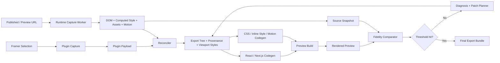

# Framer Export Fidelity Implementation Plan

## Objective

Export Framer pages, sections, and components into developer-ready React/Next.js code that matches the real Framer project or published site as closely as possible across:

- all supported breakpoints
- layout structure and nesting
- spacing, sizing, positioning, and alignment
- typography, colors, gradients, borders, shadows, and blur
- images, videos, masks, and background assets
- hover states, entry motion, transforms, and simple interactions
- reusable modules, code components, and CMS-backed content where recoverable

This is not a static HTML export system.

This is a fidelity-first React/Next.js export system.

## Product Truth

The export must match the rendered reality of the Framer page, not just the editor metadata.

That means the final authority for visual fidelity is:

- rendered DOM structure
- computed styles
- loaded fonts
- actual asset URLs
- actual breakpoint behavior
- actual transforms and motion evidence

Framer plugin data is still required, but it is not enough on its own to reliably reproduce the real site "to the dot."

## The Core Decision

### Immediate fix

Keep plugin tags, preserve style-bearing surface/container nodes, preserve wrappers in the export tree, emit better diagnostics, and force tree-driven style output instead of content-only output.

### Durable fix

Move v1 fidelity to a hybrid runtime-first pipeline:

1. plugin captures selection, node IDs, structure, components, code files, fonts, CMS, and unpublished-project context
2. runtime capture worker records rendered DOM, computed styles, assets, motion, and breakpoint-specific layout
3. reconciler merges both sources into a provenance-aware export tree
4. codegen emits React/Next.js, CSS, assets, and motion from that tree
5. fidelity engine loops on the same export until threshold, plateau, or budget exhaustion

## Delivery Principle

The exporter does not win by producing "clean" code fast.

It wins by reproducing the real Framer result first, then progressively cleaning the generated code only when the cleanup does not reduce fidelity.

Order of priorities:

1. visual accuracy
2. responsive accuracy
3. interaction and motion accuracy
4. developer-ready structure
5. code cleanliness and abstraction

If there is a conflict, the system must choose the higher item in that list.

## What Actually Broke

The current system has been too dependent on partial plugin data and partial heuristics.

The failure chain is:

1. plugin extraction does not fully describe resolved runtime styling and layout
2. style-bearing wrappers and containers have not always been treated as first-class export nodes
3. codegen has historically been stronger at emitting content than preserving layout/surface structure
4. runtime capture exists, but it has not yet become the enforced primary source for visual truth
5. the current attempt system has been closer to "try a few strategies and pick the best one" than "patch the same export until it converges"

That produces the predictable symptom:

- text appears
- some structure survives
- visual styling is incomplete
- responsive behavior is inconsistent
- motion fidelity is partial

## Success Criteria

For a simple Framer section, the exported preview must visibly match the source with:

- correct background color or image
- correct heading, paragraph, and button typography
- correct padding, gap, spacing, and container sizing
- correct button fill, radius, border, and hover behavior where present
- correct image and background asset rendering
- correct breakpoint behavior on desktop, laptop, tablet, and mobile

For a broader page export, the system must also preserve:

- page sections and nested wrappers
- reusable modules/components where identifiable
- CMS content references and collection metadata
- simple runtime motion and interaction evidence

## Non-Negotiable Architecture Rule

Do not choose architecture by taste.

Choose architecture by evidence:

- if plugin data plus tree-preserving codegen is enough, keep it
- if plugin data is insufficient and runtime computed styles prove fidelity, use runtime-first
- if CSS Modules hurt fidelity, use inline fallback for unresolved nodes
- if cleanup conflicts with accuracy, postpone cleanup

## Actual Pipeline



## Source Of Truth Model

### Plugin truth

Use the Framer plugin for:

- selection
- node identity
- parent/child hierarchy
- component/module metadata
- code files
- fonts
- text styles
- color styles
- CMS collections
- unpublished project access

Plugin truth is best for:

- identity
- structure
- authorship metadata
- editor-only context

Plugin truth is weak for:

- computed CSS
- inherited styles
- final browser layout
- exact responsive behavior
- final DOM wrappers
- runtime animation state

### Runtime truth

Use runtime capture for:

- DOM structure
- `window.getComputedStyle(...)`
- `getBoundingClientRect()`
- loaded fonts
- asset URLs
- transforms
- transitions
- animations
- breakpoint-specific layout

Runtime truth is best for:

- what the user actually sees
- visual correctness
- responsive layout
- surface styling
- text rendering
- motion evidence

### Export truth

Every emitted node must have provenance:

- `plugin`
- `runtime`
- or `merged`

Do not emit important wrappers or styles with unknown origin.

## Export Modes

### Mode 1: Runtime-first published export

Use when a published URL exists.

Priority:

1. runtime DOM and computed styles
2. plugin structure and metadata
3. plugin code/CMS/module context

### Mode 2: Runtime-first preview export

Use when a preview URL exists but the page is not fully published.

Priority:

1. preview DOM and computed styles
2. plugin structure and metadata

### Mode 3: Plugin-only fallback

Use only when no runtime page is available.

This mode must be labeled lower confidence in the report.

It must not be presented as full-fidelity export.

## Required Diagnostic Matrix

Every export run must evaluate these causes.

| Cause | How to test | Confirmed by | Ruled out by | Current direction |
|---|---|---|---|---|
| A. No styles extracted | inspect plugin payload and runtime capture | style objects empty | non-empty style objects | partially ruled out |
| B. Styles dropped from payload | inspect backend request JSON | plugin logs styles, payload misses them | payload matches plugin logs | test every failing export |
| C. Styles discarded by worker | trace payload into IR | payload has styles, IR loses them | IR retains them | test and log counts |
| D. CSS generated empty | inspect generated CSS files | CSS tiny or empty | CSS has rules and bytes | test automatically |
| E. CSS not imported | inspect TSX and build output | classes exist, import missing | import exists | test automatically |
| F. CSS module mismatch | compare JSX classes to selectors | names differ | names match | test automatically |
| G. CSS overridden | inspect matched rules in preview | rules struck through | no override conflict | browser-proof only |
| H. Fonts missing | inspect `document.fonts` and computed font | fallback font used | expected font loaded | test automatically |
| I. Layout styles missing | compare layout props | text styles exist but flex/grid/padding absent | layout props present | likely part of current problem |
| J. Plugin data misses resolved CSS | compare plugin vs runtime styles | runtime has critical missing values | plugin already sufficient | very likely confirmed |
| K. Parent/container styles lost | compare source tree vs export tree | child text emitted without styled wrappers | wrappers preserved | likely confirmed |
| L. Subtree traversal incomplete | compare selected subtree counts | wrappers absent from payload | counts align | test on every repro |
| M. Breakpoint behavior missing | compare all viewports | desktop okay, tablet/mobile wrong | viewport alignment good | still active risk |
| N. Wrong source used for styling | inspect codegen inputs | plugin attrs chosen over runtime CSS | runtime drives style output | likely confirmed |
| O. Preview build strips CSS | inspect preview build and runtime stylesheets | CSS missing after build | CSS present in build | test automatically |
| P. Assets missing | inspect images/backgrounds | broken URLs or missing bg images | assets resolve | test automatically |
| Q. Wrong section mapping | inspect selection vs matched DOM subtree | export target differs from selection | provenance aligns | test every repro |

## Required Investigation Outputs

Every job must produce:

- `raw-plugin-payload.json`
- `raw-runtime-capture.json`
- `normalized-ir.json`
- `export-tree.json`
- generated TSX/JSX
- generated CSS
- generated motion manifest
- generated asset manifest
- source screenshots per viewport
- preview screenshots per viewport
- `export-report.json`
- pass-by-pass attempt summaries
- patch history
- stop reason

## Required Runtime Property Set

The runtime capture worker must collect at least:

### Layout

- `display`
- `position`
- `top`
- `right`
- `bottom`
- `left`
- `width`
- `height`
- `minWidth`
- `minHeight`
- `maxWidth`
- `maxHeight`
- `aspectRatio`
- `flexDirection`
- `flexWrap`
- `justifyContent`
- `alignItems`
- `alignContent`
- `alignSelf`
- `justifySelf`
- `placeItems`
- `placeContent`
- `placeSelf`
- `gridTemplateColumns`
- `gridTemplateRows`
- `gridAutoFlow`
- `gridColumn`
- `gridRow`
- `gap`
- `rowGap`
- `columnGap`

### Spacing

- `marginTop`
- `marginRight`
- `marginBottom`
- `marginLeft`
- `paddingTop`
- `paddingRight`
- `paddingBottom`
- `paddingLeft`

### Surface

- `background`
- `backgroundColor`
- `backgroundImage`
- `backgroundPosition`
- `backgroundSize`
- `backgroundRepeat`
- `borderTop`
- `borderRight`
- `borderBottom`
- `borderLeft`
- `borderRadius`
- `boxShadow`
- `opacity`
- `overflow`
- `overflowX`
- `overflowY`

### Typography

- `fontFamily`
- `fontSize`
- `fontWeight`
- `lineHeight`
- `letterSpacing`
- `textAlign`
- `textTransform`
- `textDecoration`
- `whiteSpace`
- `wordBreak`
- `color`

### Stacking and transforms

- `transform`
- `transformOrigin`
- `zIndex`
- `pointerEvents`

### Motion

- `transitionProperty`
- `transitionDuration`
- `transitionTimingFunction`
- `transitionDelay`
- `animationName`
- `animationDuration`
- `animationTimingFunction`
- `animationDelay`
- `animationIterationCount`
- `animationDirection`
- `animationFillMode`
- `animationPlayState`

## Required Plugin Capture Set

The plugin must capture the selected node and full subtree with:

- node `id`
- node `type`
- node `name`
- parent-child relationships
- `getRect()` where available
- visibility
- text content
- text style references
- color style references
- font references
- size/layout traits
- stack/grid traits
- constraints/pinning if supported
- backgrounds
- fills/images/gradients if supported
- borders
- border radius
- shadows
- opacity
- overflow
- transform hints like rotation
- code component/module metadata
- CMS references
- replica/variant hints where available

If a trait cannot be read, record it as unavailable.

Do not silently coerce "missing" into "not styled."

## Required Export Tree Shape

```ts
type ExportTreeNode = {
  id: string
  kind: "frame" | "text" | "image" | "svg" | "component" | "button" | "link"
  tag: string
  provenance: "plugin" | "runtime" | "merged"
  pluginNodeId?: string
  runtimeNodeId?: string
  runtimeNodeIdsByViewport?: Partial<Record<ViewportName, string>>
  domPath?: string
  text?: string
  attributes: Record<string, string | number | boolean | undefined>
  rectByViewport: Partial<Record<ViewportName, Rect>>
  stylesByViewport: Partial<Record<ViewportName, Record<string, string>>>
  motionByViewport?: Partial<Record<ViewportName, MotionDescriptor>>
  assets: AssetDescriptor[]
  diagnostics: string[]
  children: ExportTreeNode[]
}
```

## The Real Fidelity Loop

This is the critical change.

The system must improve the same export repeatedly until threshold.

It must not stop at "best of a few different strategies."

### Wrong model

This is not enough:

1. try strategy A
2. try strategy B
3. try strategy C
4. choose the least bad output

That is search, not convergence.

### Correct model

For a single export job:

1. capture source truth
2. generate initial export from merged tree
3. render preview
4. compare preview against source
5. diagnose exact mismatch categories
6. patch the working export state
7. regenerate from patched state
8. repeat until threshold, plateau, or pass budget

### Working state

The worker must keep a mutable `workingState` across passes containing:

- merged export tree
- codegen strategy settings
- patch history
- unresolved node map
- viewport-specific overrides
- inline-style fallback flags
- motion replay flags
- semantic-tag confidence
- asset resolution choices

### Working state invariants

These invariants must hold after every pass:

- every emitted element must map back to source evidence
- every supported viewport must have a captured source snapshot
- every exported viewport must be renderable in preview
- no patch may silently delete a style-bearing wrapper without diagnosis evidence
- no pass may lower the best-so-far score for two consecutive passes without being marked as a bad branch
- every applied patch must be recorded in history
- every final export must include the pass that produced it

### Patch types

Each pass can apply targeted operations such as:

- preserve wrapper node
- split merged node group
- promote runtime-only wrapper into export tree
- switch node to inline styles
- keep runtime background over plugin background
- keep runtime transform
- synthesize missing tablet/mobile override
- emit CSS only for stable props
- lock button radius/border from runtime evidence
- preserve aspect ratio behavior
- retain overflow clipping
- classify node as semantic `button` or `link`
- downgrade node back to `div` if semantics break layout
- keep hover transition
- keep entry animation

### Pseudocode

```ts
const history: ExportAttemptResult[] = []
let workingState = createInitialWorkingState(sourceCapture, pluginPayload)

for (let pass = 1; pass <= maxPasses; pass += 1) {
  const generated = await generateFromWorkingState(workingState)
  const preview = await renderPreview(generated)
  const fidelity = await compareAgainstSource(preview, sourceCapture)
  const diagnosis = diagnoseMismatch(preview, sourceCapture, fidelity)

  history.push({
    pass,
    fidelity,
    diagnosis,
    appliedPatches: [],
  })

  if (meetsThreshold(fidelity)) {
    return finalize({
      status: "threshold_reached",
      generated,
      history,
      workingState,
    })
  }

  if (detectPlateau(history)) {
    return finalize({
      status: "plateau_detected",
      generated,
      history,
      workingState,
    })
  }

  const patches = planPatches({
    workingState,
    fidelity,
    diagnosis,
  })

  workingState = applyPatches(workingState, patches)
  history[history.length - 1]!.appliedPatches = patches
}

return finalize({
  status: "pass_budget_exhausted",
  generated: await generateFromWorkingState(workingState),
  history,
  workingState,
})
```

### Stop conditions

The export may stop only for:

- `threshold_reached`
- `plateau_detected`
- `pass_budget_exhausted`

Not for:

- "we tried several strategies"
- "desktop looked okay"
- "text matched"
- "CSS exists"

### Plateau policy

Plateau is not "we are tired of trying."

Plateau means:

- no overall score improvement of at least `1.0` over the last `3` passes
- and no category improvement of at least `2.0` in any weak category
- and no viewport improvement of at least `2.0` for any viewport below threshold

If the export plateaus below threshold, the report must explicitly say:

- which categories are still failing
- which nodes remain unresolved
- whether plugin data or runtime capture was the blocker
- whether another strategy class should be attempted in a future run

### Retry budget policy

Recommended defaults:

- max passes: `8`
- hard timeout per export job: `8m`
- max screenshot compares per viewport per pass: `1`
- max patch operations per node per pass: `3`

The loop must prefer fewer high-signal patches over many noisy ones.

## Threshold Policy

Recommended v1 thresholds:

- overall `>= 92`
- layout `>= 90`
- typography `>= 92`
- color `>= 92`
- assets `>= 95`
- nodeMatch `>= 85`
- desktop `>= 88`
- laptop `>= 88`
- tablet `>= 88`
- mobile `>= 88`
- motion `>= 75`

If one supported viewport falls under the floor, the export is not done.

### Threshold evolution

The threshold must be configurable by export mode:

- `strict`: customer-facing validation and benchmark exports
- `default`: normal production exports
- `debug`: diagnosis mode where lower thresholds are allowed so the loop can terminate with artifacts faster

Recommended defaults:

| Mode | Overall | Layout | Typography | Color | Assets | Motion |
|---|---:|---:|---:|---:|---:|---:|
| strict | 95 | 93 | 94 | 94 | 97 | 82 |
| default | 92 | 90 | 92 | 92 | 95 | 75 |
| debug | 85 | 82 | 84 | 84 | 88 | 65 |

## Fidelity Scoring Model

The system should not use a single screenshot-only score.

It needs a weighted score composed from:

- structural match
- layout match
- typography match
- color/surface match
- asset match
- motion match
- viewport consistency

Recommended weighting:

| Category | Weight |
|---|---:|
| layout | 0.30 |
| typography | 0.18 |
| color/surface | 0.16 |
| assets | 0.12 |
| structure/node match | 0.12 |
| viewport consistency | 0.07 |
| motion | 0.05 |

Screenshot diff should inform the score, not fully own it.

The comparator should combine:

- DOM/node matching
- computed style matching
- bounding box similarity
- screenshot diff
- asset presence
- font load result

## Breakpoint Fidelity Contract

The product goal is not "desktop plus maybe mobile."

It is faithful export across all supported Framer breakpoints.

Minimum supported viewports:

- desktop
- laptop
- tablet
- mobile

Each viewport needs:

- source capture
- exported preview render
- node matching
- score summary
- screenshot
- unresolved-node list

### Breakpoint synthesis rules

When codegen emits responsive styles, it must:

- keep desktop as the base only if it really is the dominant style source
- emit viewport overrides only for actual differences
- preserve layout mode changes such as `grid -> flex` or `row -> column`
- preserve viewport-specific visibility differences
- preserve viewport-specific spacing and sizing changes
- preserve viewport-specific background or image swaps where observed

### Breakpoint failure classes

The report should bucket responsive failures into:

- missing viewport override
- wrong layout mode
- wrong size constraint
- wrong hidden/visible state
- wrong order / flow
- wrong typography override
- wrong asset at viewport

## Motion Fidelity Contract

Motion is part of fidelity, not a nice-to-have.

For v1, the exporter should target:

- hover transitions
- focus transitions
- entry animations visible on initial load
- simple transform/opacity motion
- simple delay and staggering evidence where directly observable

Out of scope for initial hard guarantees:

- complex scroll timelines
- drag interactions
- state machines hidden behind app logic
- interactions requiring business logic

### Motion capture strategy

The runtime worker must capture:

- computed transition properties
- computed animation properties
- transform values before and after interaction when testable
- hover/focus deltas on actionable elements
- reduced-motion compatibility metadata

### Motion codegen strategy

Emit motion in this order of preference:

1. CSS transitions
2. CSS keyframes
3. Framer Motion wrappers only when stateful replay is required

Do not default to Framer Motion for everything.

## Runtime Capture Plan

### Capture stages per viewport

1. open target URL
2. wait for network idle
3. wait for `document.fonts.ready`
4. wait for a stable layout window
5. locate target subtree
6. capture DOM snapshot
7. capture computed styles
8. capture bounding boxes
9. capture assets and resolved URLs
10. capture hover/focus motion evidence where applicable
11. capture screenshot

### Stable layout window

Before capture, the worker should confirm layout stability by sampling bounding boxes twice across a short delay and ensuring the target subtree is not still moving.

Recommended rule:

- two reads spaced by `150ms`
- no major box delta beyond `1px` for stable nodes

### DOM capture schema

Each runtime node should include at least:

```ts
type RuntimeCaptureNode = {
  runtimeNodeId: string
  tagName: string
  textContent: string | null
  attributes: Record<string, string>
  rect: Rect
  computedStyle: Record<string, string>
  children: RuntimeCaptureNode[]
  assetUrls: string[]
  fontFamilies: string[]
  interactionEvidence?: {
    hover?: Record<string, string>
    focus?: Record<string, string>
  }
}
```

## Plugin Capture Plan

Plugin capture should stay in the pipeline, but with a narrower truth role.

It should be responsible for:

- selection origin
- framer node IDs
- subtree boundaries
- module/component metadata
- code component references
- style token references
- text style references
- color style references
- font families referenced by the project
- CMS references
- unpublished project fallback

### Plugin capture failure policy

If a Framer trait is unavailable:

- record `unavailable`
- record the attempted trait name
- record the node ID
- do not write a fake default value

## Reconciliation Plan

The reconciler is where fidelity is either preserved or destroyed.

Its job is not just "best effort matching."

Its job is to produce a merged, provenance-aware export tree that keeps all visually meaningful wrappers.

### Matching signals

Node matching should score against:

- text similarity
- subtree text fingerprint
- bounding box overlap
- tag compatibility
- asset URL overlap
- relative depth
- sibling order
- accessible role hints
- plugin node name hints
- Framer node path ancestry

### Wrapper preservation rules

Keep a wrapper when any of these are true:

- it has a non-transparent background
- it contributes padding or gap
- it clips overflow
- it carries border, radius, or shadow
- it defines layout mode
- it carries transform or opacity
- it changes visibility by viewport
- removing it changes child bounds materially

### Runtime-only wrappers

If the runtime DOM has a meaningful wrapper not represented cleanly in plugin data:

- preserve it in the export tree
- mark it `provenance: "runtime"`
- include a diagnostic so cleanup passes can revisit it later

## Codegen Plan

The first-pass codegen target is developer-ready React/Next.js with fidelity safeguards.

That means:

- tree-driven rendering
- CSS Modules for stable reusable rules
- inline styles for unresolved or viewport-variant properties
- explicit asset imports/copies
- deterministic class naming
- a preview entry that renders exactly what the export report scored

### Style emission policy

Emit a property into CSS when it is:

- stable across viewports or correctly expressible by media rules
- not dependent on one-off runtime patching
- safe to reuse without mis-styling siblings

Emit a property inline when it is:

- unresolved after reconciliation
- target-specific
- generated by a corrective patch
- too risky to generalize into shared CSS

### Semantic recovery policy

Prefer semantic tags when they do not hurt fidelity:

- `button`
- `a`
- `img`
- headings
- paragraphs

If semantics break layout or styling replay, keep `div` or `span` for v1 and record the downgrade.

## Self-Improving Export Loop Implementation

This is the part your earlier expectation was pointing at: the system should keep improving the export until the score is good enough.

That means we need a real feedback loop, not just a one-shot exporter with a report.

### Loop phases

1. capture source truth
2. build working export tree
3. generate code
4. build preview
5. render preview in browser
6. compare source vs preview
7. diagnose mismatch categories and nodes
8. plan targeted patches
9. mutate working state
10. repeat

### Patch families

Patch planning should draw from these buckets:

- structure patches
- style patches
- responsive patches
- asset patches
- motion patches
- semantic patches

### Example patch rules

If layout score is low and node boxes diverge:

- preserve or restore wrapper
- promote runtime layout props
- lock width/height/min/max from runtime evidence

If typography score is low:

- prefer runtime font props
- force inline typography on failing nodes

If color/surface score is low:

- prefer runtime backgrounds, borders, shadows
- keep wrapper opacity and clipping

If asset score is low:

- replace unresolved URLs
- preserve background images inline until asset mapping is stable

If motion score is low:

- keep transition props
- preserve hover style deltas

### Bad-branch handling

If a pass meaningfully harms fidelity:

- mark the patch combination as a bad branch
- revert to the best working state
- continue from best-so-far, not from the broken state

### Best-so-far rule

The final export should be:

- the threshold-reaching pass if one exists
- otherwise the best-scoring pass, even if later passes were worse

## Workstream Plan

### Workstream 1: Evidence and observability

Build:

- full artifact bundle
- compare diagnostics
- pass history
- viewport summaries
- node-level unresolved report

Done when:

- any export failure can be explained from artifacts alone

### Workstream 2: Runtime-first source capture

Build:

- stable Playwright capture
- multi-viewport source snapshots
- font and asset diagnostics
- hover/focus probes

Done when:

- published/preview pages always produce runtime capture artifacts before codegen

### Workstream 3: Provenance-aware reconciliation

Build:

- robust node matcher
- wrapper preservation
- runtime-only wrapper support
- merged viewport styles

Done when:

- exported tree no longer collapses style-bearing structure into text-only output

### Workstream 4: Fidelity-safe codegen

Build:

- CSS Modules plus inline fallback
- responsive override emission
- deterministic asset emission
- motion rule emission

Done when:

- minimal fixtures visibly render with real styling in preview

### Workstream 5: Convergence engine

Build:

- patch planner
- patch applier
- best-so-far tracking
- plateau detection
- stop reason reporting

Done when:

- low-fidelity exports improve over multiple passes automatically

### Workstream 6: Validation and acceptance

Build:

- smoke fixtures
- visual compare fixtures
- threshold gates
- export report summaries

Done when:

- regressions fail in CI before shipping

## Acceptance Fixtures

The implementation should be proven on at least these fixtures:

### Fixture A: simple styled section

- one container
- one heading
- one paragraph
- one button
- clear background
- clear radius/padding/gap

### Fixture B: responsive card section

- multi-column desktop
- stacked mobile
- different spacing across breakpoints

### Fixture C: hero with background image

- text over image
- overlay
- button group

### Fixture D: animated CTA block

- hover transition
- entry animation
- transform/opacity motion

### Fixture E: CMS-backed list

- repeated cards
- image and text content
- collection metadata

## CI Gates

CI should fail when any of these are true:

- generated CSS exists but is empty
- component references CSS that does not exist
- JSX class names do not match emitted selectors
- preview has only default browser styles
- source font failed to load without being reported
- a required viewport capture is missing
- overall score is below the configured threshold for the fixture
- best-so-far pass is not persisted in the bundle

## Execution Order

Build this in order:

1. observability and artifact completeness
2. runtime-first capture enforcement
3. reconciliation and wrapper preservation
4. tree-driven codegen with inline fallback
5. convergence loop and best-so-far logic
6. breakpoint and motion hardening
7. CMS/module polish

## Final Product Recommendation

The v1 export pipeline should be:

1. plugin capture for identity, selection, hierarchy, code/CMS/module context, and unpublished fallback
2. runtime capture for real rendered truth across all viewports
3. provenance-aware reconciliation into a merged export tree
4. tree-driven React/Next.js codegen with CSS Modules plus inline fallback
5. automated preview rendering and compare
6. iterative corrective loop until threshold, plateau, or pass budget

What to postpone:

- beautification-first refactors
- aggressive component abstraction
- perfect reconstruction of advanced Framer interaction logic
- cleanup passes that are not fidelity-safe

## Milestone Plan

### Phase 0: Instrument everything

Goal:

- every export is inspectable without rerunning

Deliver:

- raw payloads
- runtime capture artifacts
- report stats
- pass history
- debug bundle

Done when:

- every failure says where styling was lost

### Phase 1: Deep plugin capture

Goal:

- plugin-only fallback carries enough structure and style-bearing metadata to be useful

Implement:

- deeper subtree traversal
- stronger wrapper preservation
- richer style extraction from Framer traits
- token/font/code/CMS manifests

Done when:

- a simple unpublished section payload contains container/background/padding/gap/typography/button info

### Phase 2: Runtime-first enforcement

Goal:

- published and preview exports always capture runtime before codegen

Implement:

- capture mode selection
- runtime capture before IR build
- per-viewport screenshots and computed-style artifacts

Done when:

- report clearly shows `captureMode: "runtime-first"` for published/preview jobs

### Phase 3: Reconciliation quality

Goal:

- keep the right wrappers and map the right DOM subtree

Implement:

- stronger matching signals
- runtime-only wrapper preservation
- low-confidence mismatch reporting

Done when:

- wrong section mapping and missing-wrapper cases are obvious in diagnostics

### Phase 4: Tree-driven codegen only

Goal:

- fidelity mode codegen uses only merged export-tree input

Implement:

- per-node class generation
- per-node inline fallback
- responsive rule synthesis from viewport deltas
- stable CSS for reusable rules

Done when:

- a minimal section visibly renders with background, spacing, typography, and button styling

### Phase 5: Corrective convergence loop

Goal:

- keep improving the same export until threshold

Implement:

- diagnosis engine
- patch planner
- patch applier
- plateau detector
- attempt history and stop reason

Done when:

- later passes materially improve earlier low-scoring passes

### Phase 6: Breakpoint fidelity

Goal:

- all supported breakpoints matter, not just desktop

Implement:

- viewport-specific rect/style storage
- viewport-specific compare
- viewport-specific codegen overrides

Done when:

- tablet/mobile layout differences survive export

### Phase 7: Motion fidelity

Goal:

- preserve visible motion where runtime evidence exists

Implement:

- capture runtime transitions/animations
- classify motion kind
- emit CSS transitions first
- use Framer Motion only when structure needs stateful motion

Done when:

- hover and entry motion survive for representative samples

### Phase 8: Assets, fonts, CMS, and components

Goal:

- keep output developer-ready, not just screenshot-similar

Implement:

- asset manifests
- font diagnostics
- code file manifests
- CMS collection manifests
- component/module references

Done when:

- exports include visual output plus usable developer context

## Package-Level Implementation Map

### `apps/plugin/src/App.tsx`

Implement or harden:

- full subtree traversal from selected node
- trait-safe metadata extraction
- richer capture stats
- token/font/code/CMS collection capture
- explicit missing-trait diagnostics

### `apps/plugin/src/framer-style-extraction.ts`

Implement or harden:

- stack/grid extraction
- background/overflow/aspect-ratio extraction
- item placement traits
- border/radius/shadow normalization
- transform hints

### `packages/exporter-core/src/capture.ts`

Implement or harden:

- runtime-first capture path
- viewport capture for desktop/laptop/tablet/mobile
- `document.fonts.ready`
- stylesheet diagnostics
- focused computed-style property capture
- motion evidence capture
- source screenshots

### `packages/exporter-core/src/ir.ts`

Implement or harden:

- merged export tree build
- runtime-only wrapper preservation
- viewport-specific style snapshots
- assets and motion attachment
- provenance completeness

### `packages/matcher/src/match.ts`

Implement or harden:

- plugin-to-runtime node reconciliation
- framer-tree-aware matching
- wrong-target diagnostics
- confidence scoring

### `packages/codegen/src/next-project.ts`

Implement or harden:

- tree-only fidelity mode rendering
- CSS Modules for stable reusable rules
- inline style fallback for unresolved values
- viewport override emission
- background/asset replay
- motion rule emission

### `packages/fidelity/src/compare.ts`

Implement or harden:

- per-viewport style/layout compare
- per-node mismatch buckets
- motion compare
- asset compare
- machine-actionable diagnosis output

### `packages/exporter-core/src/attempt-planner.ts`

Implement or harden:

- diagnosis-driven patch planning
- working-state mutation
- plateau detection
- pass history
- stop-reason handling

### `packages/exporter-core/src/local-export.ts`

Implement or harden:

- artifact bundling
- debug bundle manifest
- report enrichment
- retry loop wiring
- pass-by-pass export snapshots

## Preview App Contract

The preview app must prove styling is actually applied.

For each export:

- generated component imports CSS if CSS exists
- JSX class names match CSS selectors
- at least one exported element has non-default computed styles
- background/font/color/layout visibly apply in preview
- CSS build/runtime errors fail the export

## Testing Plan

Run during implementation:

```bash
npm run test:exporter
./node_modules/.bin/tsc --noEmit --pretty false
```

Run a local export fixture:

```bash
npx tsx packages/exporter-core/src/local-export.ts
```

## Required Tests

### Unit

- generated CSS file is non-empty
- generated component imports CSS
- JSX class names match CSS selectors
- export tree preserves wrappers
- per-viewport overrides emit when styles differ
- diagnosis buckets map to patch operations

### Integration

- simple section export with container, heading, paragraph, and button
- multi-breakpoint export where tablet/mobile layout differs
- background-image and asset export
- font warning when source font is missing
- runtime-inline debug mode produces visibly styled output

### Browser smoke

- at least one exported element has non-default computed styles
- background is visible
- button has fill/radius/border
- text has expected font size/color
- mobile layout changes when source differs

### Visual regression

For each viewport:

- source screenshot
- exported preview screenshot
- diff heatmap
- score summary

## Minimal Reproduction Bundle

Every debugging session must be able to produce:

- Framer URL or preview URL
- selected node ID
- raw plugin payload
- raw runtime capture
- normalized IR
- export tree
- generated TSX
- generated CSS
- preview screenshots
- source screenshots
- export report
- diagnosis history
- patch history

## Risks

- plugin-only exports will still be weaker on complex responsive auto-layout
- exact Framer interaction semantics may not be fully recoverable from computed styles alone
- runtime DOM may contain noisy wrappers that still need to be kept for fidelity
- some exports will need mixed CSS plus inline styles before clean abstraction is safe

## What Not To Do

- do not bet v1 fidelity on flattened plugin node attributes alone
- do not strip wrappers early for cleaner code
- do not force CSS Modules purity if inline styles are needed
- do not call strategy swapping a fidelity loop
- do not declare desktop-only success
- do not optimize for pretty code before visual correctness works

## Current Repo Reading

The repo is already moving in the right direction:

- payload, IR, export-tree, runtime capture, and debug artifacts exist
- per-viewport capture and comparison exist
- matcher and plugin tree fallback have improved
- attempt planning and patch application exist in some form

But the product goal is stricter than the current implementation state.

Today the system is better than text-only export, but it is not yet proven to match real Framer output across all breakpoints, layout, and motion at threshold.

That means the next work should focus on:

1. enforcing runtime-first fidelity when available
2. preserving all style-bearing wrappers and viewport overrides
3. upgrading the planner into a true same-export convergence loop
4. proving the result on representative Framer fixtures

## Final Recommendation

### What exactly broke

The export path has been losing fidelity because content survives more reliably than the layout/surface/motion structures that make the page look correct, and because runtime visual truth has not yet fully driven the generated output.

### Why previews showed only text

Because text nodes were preserved and rendered while style-bearing wrappers, layout traits, runtime-computed values, and breakpoint-specific rules were either missing, weakened, or not made authoritative in codegen.

### Can Framer plugin APIs alone solve this

Not for high-fidelity export of real Framer sites across breakpoints, layout, and motion.

They are necessary, but not sufficient.

### Do we need rendered DOM and computed-style capture

Yes.

For published pages and preview URLs, that should be the primary fidelity path.

### What should the v1 export pipeline be

1. plugin for selection, IDs, hierarchy, code files, fonts, CMS, and unpublished fallback
2. runtime capture for visual truth across all supported viewports
3. merged provenance-aware export tree
4. tree-driven codegen with CSS plus inline fallback
5. same-export corrective loop until threshold, plateau, or budget exhaustion

### What should be postponed

- advanced cleanup/refactoring passes
- aggressive abstraction into reusable components
- perfect CMS reconstruction
- perfect reconstruction of complex Framer interaction timelines

Accuracy first.

Structure second.

Cleanliness third.
