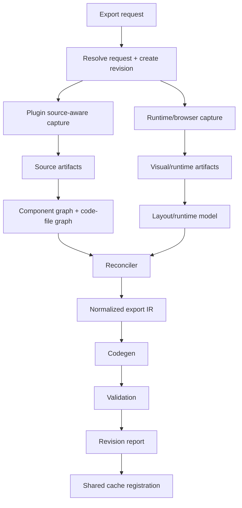

# CodeRelay Implementation Plan: Option 2 + Option 4

## Decision

We are choosing these two tracks together:

1. `Option 2`: revision and artifact model
2. `Option 4`: plugin Code File content + recursive variant capture

This is the correct pair because Option 4 gives us the missing source-aware evidence, and Option 2 is what makes that evidence durable, reusable, and safe to build on in later exports.

If we do only Option 4, we improve one export and then keep recollecting the same evidence over and over.

If we do only Option 2, we cache an incomplete view of the project and make the wrong output faster.

The combined goal is:

- new exports capture the right evidence on the first run
- future exports reuse that evidence when the source has not changed
- later improvement passes regenerate only what is invalidated
- recapture becomes a recovery path, not the default workflow

### Commitment for future exports

This plan is not just about repairing the current failing exports.

It must change the default behavior of CodeRelay so that a brand-new export already:

- captures source-aware plugin evidence during revision `0001`
- writes reusable source artifacts before heavy runtime capture
- records completeness and portability status immediately
- seeds the shared cache on the first successful run
- becomes a valid parent revision for the very next export without requiring a repair pass

If a future export still needs an automatic “fix-up recapture” to become trustworthy, then this implementation is incomplete.

---

## What “done” means

After this work, a fresh export of a Framer project should:

- capture plugin-visible component, variant, override, and Code File evidence immediately
- persist that evidence as revisioned artifacts
- derive reusable normalized component models from that evidence
- generate code and reports from the normalized model
- reuse prior artifacts automatically when fingerprints match
- fail loudly when required evidence is missing instead of reporting a false success

Later exports of the same project should:

- compare current source/plugin fingerprints against prior artifacts
- reuse unchanged Code File, component-family, and normalized-model artifacts
- regenerate only affected component families, dependent IR, dependent codegen output, and dependent validation
- avoid blanket recapture unless the system can prove it is necessary

---

## Non-negotiable product rule

Future exports must not depend on “repair by recapture” as the normal experience.

That means:

- every fresh export must perform source-aware plugin capture by default
- the cache must be seeded correctly during the initial export
- every artifact must carry enough provenance to be reused later
- every invalidation must be explicit and explainable
- selective recapture must exist, but it must be a fallback, not the happy path

If a future export needs full recapture all the time, this plan has failed.

---

## Fresh-export bootstrap contract

This is the operational rule for all new exports.

The first export of a project must seed the artifacts that later exports depend on. We are not allowed to skip source-aware capture on revision `0001` and then rely on a later repair pass to make the export reusable.

### Required first-run sequence

Before browser-heavy runtime capture begins, the pipeline must:

1. resolve the request and validate `exportMode`
2. create the revision record immediately
3. run plugin preflight
4. capture source-aware plugin artifacts
5. persist those artifacts with stable hashes
6. compute source evidence completeness
7. write reuse and invalidation plans, even for revision `0001`
8. seed the reusable cache with complete source artifacts
9. continue into runtime capture and codegen

That means revision `0001` already contains:

- Code File source artifacts
- Code File metadata artifacts
- component-family artifacts
- override-assignment artifacts
- capability and source-evidence reports
- cache registration metadata

### First-run failure policy

If a project clearly contains component/code semantics but source-aware capture cannot produce the required artifacts, the system must not silently continue as if the export is healthy.

It must do one of these explicitly:

1. fail the export
2. complete with `partial` source evidence and a visible degraded-fidelity status

It must never:

- mark the export as fully healthy while required source artifacts are missing
- pretend runtime capture alone is enough for reusable component fidelity
- defer source-aware capture to a later pass without recording that the initial revision is incomplete

### Why this section matters

This is the concrete mechanism that prevents future exports from needing routine recapture.

If revision `0001` is seeded correctly:

- repeated exports can reuse source-aware artifacts immediately
- component-only improvements can skip unrelated runtime capture
- responsive improvements can reuse component semantics
- revalidate-only revisions can avoid capture entirely

If revision `0001` is seeded incorrectly, every later workflow becomes slower, noisier, and less trustworthy.

---

## Why this is the right fix

The failures we have seen fall into one repeated pattern:

- the pipeline can produce output even when source-aware evidence is incomplete
- the job may be marked as “successful” because some files were written
- the missing evidence only shows up later as blank output, missing states, missing behavior, or low-fidelity layout

The violated invariant is:

> A reusable export pipeline must preserve authoring evidence and provenance all the way from capture to codegen.

Right now that invariant is only partially enforced.

Option 4 fixes the evidence gap.

Option 2 fixes the durability and reuse gap.

Together they fix the actual system behavior, not just one bad export.

---

## Framer boundary we are designing around

This plan is based on the Framer plugin boundary we can actually rely on:

- plugin access to selection, nodes, hierarchy, traits, component identity, component instances, and some style/runtime-related metadata
- plugin access to Code File content and exports where the API exposes them
- plugin access to project and CMS context

This plan does **not** assume Framer gives us a full source export of the published site.

So the architecture is:

- plugin capture for authoring semantics and source-aware component evidence
- runtime/browser capture for rendered layout and visual truth
- a reconciler that merges both into a stable export IR

That keeps us honest and prevents us from pretending plugin metadata alone is enough for full visual fidelity.

Source grounding used here:

- `/Users/MAC/.agents/skills/framer-plugins/SKILL.md`

---

## Scope

This implementation plan covers:

- revision records
- artifact manifests
- content-addressed shared cache
- source-aware Code File capture
- recursive component-family capture
- override capture and assignment mapping
- component-family normalization
- component-aware invalidation
- first-run cache seeding for new exports
- selective regeneration for later exports
- UI/reporting so reuse and missing evidence are visible
- tests so this cannot silently regress

This plan does not attempt, in this phase, to fully solve:

- perfect motion parity for every Framer animation
- arbitrary third-party browser script compatibility
- unsupported Code Component runtime dependencies with zero adaptation work
- complete elimination of runtime capture

---

## Desired end state

For every export job we should end up with:

```text
job_<id>/
├── revision_0001/
│   ├── status.json
│   ├── parent.json
│   ├── manifests/
│   │   ├── revision-manifest.json
│   │   ├── artifact-index.json
│   │   ├── invalidation-plan.json
│   │   ├── capability-report.json
│   │   ├── reuse-plan.json
│   │   └── resolved-request.json
│   ├── source-artifacts/
│   │   ├── manifest.json
│   │   ├── project-snapshot.json
│   │   ├── component-catalog.json
│   │   ├── component-families.json
│   │   ├── override-assignments.json
│   │   ├── code-files/
│   │   │   ├── <content-hash>.json
│   │   │   └── <content-hash>.tsx
│   │   ├── code-compatibility-report.json
│   │   └── source-evidence-report.json
│   ├── capture/
│   ├── ir/
│   │   ├── export-ir.json
│   │   ├── component-model.json
│   │   └── component-dependency-graph.json
│   ├── generated/
│   ├── validation/
│   ├── export-report.json
│   └── export.zip
└── revision_0002/
    └── ...
```

And a shared cache outside the job:

```text
.coderelay/
└── revision-cache/
    ├── source/
    ├── ir/
    ├── generated/
    └── validation/
```

The shared cache is the mechanism that makes later exports cheap.

The per-revision directory is the mechanism that makes every export explainable and auditable.

---

## Core invariants

### Invariant 1: Missing evidence is never treated as success

If Code File content is unavailable, the system must record why:

- unreadable
- unavailable through plugin API
- external or unresolved
- permission-gated
- empty content
- capture error
- truncation

An empty array is not equivalent to “no Code Files”.

### Invariant 2: Cache reuse depends on fingerprints, not on path existence

An artifact is reusable only if:

- schema version matches
- capture strategy version matches
- codegen version matches where relevant
- dependency hashes match
- status is `complete`
- required files exist
- required byte sizes are non-zero

### Invariant 3: Fresh exports seed reusable source-aware artifacts

A new export must capture and persist:

- Code File content and metadata
- Code File export metadata
- component family graph
- replica/primary relationships
- inherited traits
- instance attributes/controls
- override assignments

This must happen during initial export, not only during repair revisions.

### Invariant 4: Regeneration stays within dependency scope

If one Code File changes, we invalidate only:

- that Code File artifact
- dependent component-family artifacts
- dependent normalized component model artifacts
- dependent generated modules
- dependent validation artifacts

We do not invalidate the whole export unless the dependency graph proves we must.

### Invariant 5: Every revision explains its reuse decisions

Every revision must produce:

- what was reused
- what was regenerated
- why each invalidation happened
- whether source evidence is `complete` or `partial`

---

## Architecture summary



The important change is that plugin capture is no longer an optional add-on.

It becomes a first-class artifact stage with its own fingerprints, failures, and reuse path.

---

## No-routine-recapture rules

These rules define when later exports are allowed to reuse, selectively regenerate, or recapture.

### Reuse by default

The pipeline must reuse existing source-aware artifacts when all of these still match:

- project fingerprint
- plugin fingerprint
- source-aware schema version
- Code File content hashes
- component-family signatures
- override-assignment signature
- export strategy version
- prior artifact completeness and integrity

### Selective regeneration allowed

The pipeline may regenerate only the dependency cone when one of these changes:

- one Code File changed
- one component family changed
- one override assignment changed
- one codegen schema changed
- one validation strategy changed

In those cases, regenerate only the artifacts that can be proven to depend on the changed node.

### Recapture allowed only with proof

Recapture is allowed when one of these is true:

- runtime-responsive evidence is missing or invalid
- source-aware artifact capture previously returned `partial`
- a required artifact is corrupt or zero-byte
- the project or publish fingerprint changed materially
- the capture schema version changed incompatibly
- the user explicitly requested refresh

### Recapture is not allowed just because

Blanket recapture must not happen merely because:

- a previous export exists
- the output directory changed
- a build was rerun
- a report was regenerated
- validation was rerun
- one downstream generated file is missing while valid source artifacts still exist

Without this rule, the cache becomes decorative instead of functional.

---

## Workstream A: Option 2 revision and artifact model

## Objective

Turn the exporter into a revisioned pipeline where unchanged evidence and unchanged output can be reused safely across:

- a repeated export of the same source
- improvement revisions
- component-focused revisions
- revalidate-only revisions
- exporter upgrades with selective invalidation

## Required deliverables

- explicit revision creation
- revision metadata in shared types
- artifact registry
- invalidation planner
- reuse planner
- shared cache registration
- legacy-job migration path
- UI/report visibility for cache hits and misses

### A1. Shared types and manifest contracts

Files:

- `/Users/MAC/Desktop/Desktop - Poe's MacBook Pro/Engineering/Builds/code-relay/packages/shared/src/types.ts`

Add or finalize:

```ts
type RevisionKind = "initial" | "improvement"

type RevisionReason =
  | "initial-export"
  | "responsive-improvement"
  | "component-source-refresh"
  | "interaction-improvement"
  | "revalidate-only"
  | "schema-upgrade"
  | "manual-regeneration"

type RequestedFocus = "responsiveness" | "components" | "both" | "revalidate"

type SourceEvidenceStatus = "complete" | "partial"

type ArtifactStatus = "complete" | "failed"

type ArtifactType =
  | "source/project-snapshot"
  | "source/component-catalog"
  | "source/component-families"
  | "source/code-file"
  | "source/override-assignments"
  | "source/code-compatibility"
  | "ir/normalized"
  | "ir/component-model"
  | "generated/component-module"
  | "generated/page-module"
  | "generated/styles"
  | "validation/build"
  | "validation/runtime"
  | "validation/interaction"
  | "report/export"
```

Add:

- `ExportRevisionRecord`
- `ArtifactRecord`
- `ArtifactReference`
- `ArtifactInvalidation`
- `ReusePlan`
- `SourceEvidenceReport`
- `ComponentSourceFingerprint`
- `CodeFileSnapshot`

### A2. Revision creation and planning

Primary file:

- `/Users/MAC/Desktop/Desktop - Poe's MacBook Pro/Engineering/Builds/code-relay/packages/exporter-core/src/local-export.ts`

Required phases:

1. resolve request
2. create or load revision context
3. derive source fingerprint
4. derive plugin fingerprint
5. load parent revision if present
6. compute reuse plan
7. compute invalidation plan
8. persist initial source-aware artifacts before downstream capture
9. execute only invalidated stages
10. write revision manifest and artifact index
11. register reusable artifacts in shared cache

Planning output must be written before heavy work begins:

- `resolved-request.json`
- `reuse-plan.json`
- `invalidation-plan.json`

### A3. Fingerprinting model

We need four separate fingerprint layers.

#### Request fingerprint

Includes:

- source URL
- export mode
- selector
- requested focus
- target fidelity
- capture strategy version

#### Source fingerprint

Includes:

- normalized publish URL
- plugin project identifier if available
- plugin publish metadata if available
- route manifest summary if relevant
- selection or component scope identifiers

#### Plugin fingerprint

Includes:

- Code File ids
- Code File version ids if available
- Code File content hashes
- component ids
- component family signatures
- override assignment signature
- plugin capability flags

#### Artifact fingerprint

Includes:

- artifact schema version
- relevant input fingerprint
- dependency hashes
- content hash
- codegen version when artifact is generated code

### A4. Artifact registry

Every artifact written by the exporter must get an entry with:

- `artifactId`
- `artifactType`
- `schemaVersion`
- `hash`
- `dependencyHashes`
- `status`
- `byteSize`
- `relativePath`
- `createdAt`

Required behavior:

- zero-byte output is treated as failed, not complete
- malformed JSON is treated as corrupt
- missing dependency hashes make artifact non-reusable

### A5. Shared cache registration

We need deterministic registration under:

- `.coderelay/revision-cache/source`
- `.coderelay/revision-cache/ir`
- `.coderelay/revision-cache/generated`
- `.coderelay/revision-cache/validation`

Registration rules:

- only `complete` artifacts are cacheable
- cache key = artifact type + schema version + hash
- revisions store references, not copies, for shared reuse decisions
- job-local copies can still exist for portability

### A6. Invalidation planner

The invalidation planner must be dependency-aware.

Examples:

- changed Code File hash invalidates dependent component families
- changed component-family artifact invalidates normalized component model
- changed normalized component model invalidates generated component modules
- changed generated component module invalidates runtime validation for affected pages/components

Invalidation reasons must be explicit:

- `source-fingerprint-changed`
- `plugin-fingerprint-changed`
- `schema-version-changed`
- `dependency-changed`
- `artifact-missing`
- `artifact-corrupt`
- `capability-was-partial`
- `user-requested-refresh`

### A7. Revision modes

We should support these revision modes consistently:

#### Initial export

- capture everything required for first-run correctness
- seed all reusable source artifacts
- seed normalized component artifacts
- seed generated output artifacts

#### Component-source refresh

- recompute plugin source-aware artifacts
- reuse unchanged runtime/layout artifacts
- regenerate dependent component output only

#### Responsive improvement

- reuse component/source artifacts
- refresh only responsive/runtime-dependent artifacts

#### Revalidate-only

- reuse source, IR, and generated output
- rerun validation and reporting only

This is important because it lets us improve exports without destroying prior useful work.

### A8. Migration for old jobs

We already have early migration support. This plan formalizes it.

Legacy jobs must be upgradable into revisioned jobs by:

- creating `revision_0001`
- synthesizing revision manifest from existing artifacts
- computing best-effort artifact hashes for existing files
- marking weak or unverifiable artifacts as `partial`
- registering cacheable artifacts when integrity checks pass

This ensures old successful exports remain usable and can become parents for better revisions.

### A9. Web and worker visibility

Files:

- `/Users/MAC/Desktop/Desktop - Poe's MacBook Pro/Engineering/Builds/code-relay/apps/worker/src/index.ts`
- `/Users/MAC/Desktop/Desktop - Poe's MacBook Pro/Engineering/Builds/code-relay/apps/worker/src/artifacts.ts`
- `/Users/MAC/Desktop/Desktop - Poe's MacBook Pro/Engineering/Builds/code-relay/apps/web/app/jobs/[id]/page.tsx`
- `/Users/MAC/Desktop/Desktop - Poe's MacBook Pro/Engineering/Builds/code-relay/apps/web/lib/job-artifacts.ts`

Required UI/report fields:

- current revision id
- parent revision id
- requested focus
- source evidence status
- reused artifact count
- invalidated artifact count
- cache hits by stage
- cache misses by stage
- partial-source warnings
- explicit “no recapture needed” / “selective recapture required” status

---

## Workstream B: Option 4 plugin Code File content and recursive variant capture

## Objective

Capture enough authoring semantics from the plugin layer to reconstruct reusable components, preserve component families, preserve override context, and make later exports source-aware by default.

This is not “grab some metadata”.

This is a real source capture lane with reuse value.

## Required deliverables

- Code File snapshot capture
- Code File content persistence
- Code File export metadata persistence
- recursive component graph traversal
- component-family normalization
- replica and inheritance tracking
- instance control capture
- override assignment capture
- source evidence report
- code compatibility analysis

### B1. Plugin capture contract

The plugin payload must explicitly distinguish:

- what was read successfully
- what was not readable
- what the API does not expose
- what was truncated
- what was inferred

Required payload sections:

```ts
type PluginSourceArtifactsPayload = {
  projectSnapshot: ProjectSnapshot
  componentCatalog: ComponentCatalogEntry[]
  componentFamilies: ComponentFamilySnapshot[]
  codeFiles: CodeFileSnapshot[]
  overrideAssignments: OverrideAssignment[]
  capabilityReport: PluginCapabilityReport
  sourceEvidenceReport: SourceEvidenceReport
}
```

This payload must become part of the initial export request or be written as the earliest artifact stage.

### B2. Code File capture

Files to update:

- `/Users/MAC/Desktop/Desktop - Poe's MacBook Pro/Engineering/Builds/code-relay/apps/plugin/src/App.tsx`
- plugin capture helpers under `apps/plugin/src/`
- `/Users/MAC/Desktop/Desktop - Poe's MacBook Pro/Engineering/Builds/code-relay/packages/exporter-core/src/local-export.ts`

For each readable Code File, capture:

- file id
- file name
- logical path
- export names
- source text
- byte size
- content hash
- version id if available
- parse status
- import list
- local dependency references

For each unreadable Code File, capture:

- identifier
- name if available
- reason unreadable
- capability flag that failed

Storage:

- `source-artifacts/code-files/<content-hash>.tsx`
- `source-artifacts/code-files/<content-hash>.json`

Why hash by content instead of file id:

- different revisions can reuse identical content
- renames do not force false invalidation
- we can compare true source changes instead of path changes

### B3. Recursive component traversal

For each component or component-like node:

1. capture node identity
2. capture component identifier if available
3. capture insertion/module URL if available
4. capture primary vs replica status
5. capture parent family relationship
6. capture variant traits
7. capture breakpoint traits
8. capture inherited attributes
9. capture local attributes
10. capture gesture metadata
11. capture instance controls
12. capture children recursively
13. link any associated Code File / module identity

The exported snapshot must preserve structure.

We must not flatten component families into a simple list too early.

### B4. Component family model

We need a stable normalized family representation:

```ts
type ComponentFamilySnapshot = {
  id: string
  name: string
  primaryVariantId?: string
  variants: Array<{
    id: string
    name: string
    nodeId: string
    isPrimary: boolean
    breakpoint?: string
    inheritedFrom?: string
    gesture?: string
    controlsSignature?: string
    codeFileHash?: string
  }>
  interactionEdges: Array<{
    fromVariantId: string
    toVariantId: string
    trigger: "click" | "hover" | "press" | "focus" | "auto" | "unknown"
    confidence: "high" | "medium" | "low"
    evidence: string[]
  }>
  replicas: Array<{
    id: string
    sourceVariantId?: string
    breakpoint?: string
  }>
}
```

Important rule:

Never invent an interaction edge only because multiple variants exist.

If an edge is inferred, it must be labeled as inferred and low confidence.

### B5. Override capture

We need separate capture for:

- override source module identity
- exported override names
- node or component assignments where visible
- compatibility status

This matters because export quality drops hard when overrides disappear silently.

Required output:

- `override-assignments.json`
- compatibility result per override
- explicit unsupported list in the final report

### B6. Code compatibility analysis

After Code File capture, run a compatibility pass.

It should classify each Code File / component / override into:

- `portable`
- `portable-with-adaptation`
- `runtime-fallback-only`
- `unsupported`

Analysis inputs:

- imports
- framer runtime dependencies
- local alias usage
- browser-only globals
- unresolved project-local imports
- unsupported package imports

Outputs:

- `code-compatibility-report.json`
- compatibility summary in `export-report.json`
- copy of unadapted source in a visible artifact folder when not portable

### B7. Source evidence status

Source evidence status for the revision must be computed from actual capture results:

`complete` when:

- all required source-aware artifact categories were captured successfully
- no required Code File is missing when the project indicates component/code usage
- component families and override mappings were built without structural gaps

`partial` when:

- any required category is missing
- any required file is unreadable
- any traversal failed
- any override assignment is unresolved

This status must be user-visible.

That avoids fake “success” when the output is already compromised.

### B8. Fresh-export default behavior

This is the most important part for your requirement.

On a brand-new export, the pipeline must do this automatically:

1. resolve request
2. run plugin preflight
3. capture source-aware plugin evidence
4. write source artifacts immediately
5. compute source evidence status
6. seed shared cache with complete artifacts
7. continue into runtime capture and codegen

That means future exports start with the right evidence already in the system.

Recapture should only be triggered when:

- source fingerprint changed
- plugin fingerprint changed
- a previous artifact is partial/corrupt
- schema version changed
- user explicitly requests improvement on stale evidence

This is how we avoid “fix it later by recapture” becoming normal.

---

## Dependency graph for selective reuse

We need an explicit graph like this:

```text
Code File source
  -> Code File snapshot
  -> compatibility analysis
  -> component family normalization
  -> normalized component model
  -> generated component modules
  -> generated page modules that depend on those components
  -> runtime validation
  -> interaction validation
  -> final report
```

And:

```text
Override assignment changes
  -> override assignment artifact
  -> normalized component model
  -> generated component/page modules
  -> runtime validation
  -> final report
```

And:

```text
Component family graph changes
  -> normalized component model
  -> generated component modules
  -> interaction validation
  -> final report
```

This graph is what allows selective regeneration instead of blanket recapture.

---

## Pipeline changes, stage by stage

## Stage 0: First-run bootstrap and cache seeding

This stage exists specifically to make future exports good from scratch.

It runs before browser-heavy capture and before any expensive regeneration decision is finalized.

Responsibilities:

- create the revision directory
- write the initial revision manifest shell
- attempt parent revision discovery
- compute request, source, and plugin fingerprints
- write an artifact registry scaffold
- run plugin source-aware capture
- persist source-aware artifacts immediately
- compute source evidence completeness
- register complete source artifacts in shared cache

### Required logs

- revision id
- parent revision id
- request fingerprint
- source fingerprint
- plugin fingerprint
- first-run seeded artifact count
- source evidence status

## Stage 1: Request resolution

Add hard validation:

- missing `url` fails immediately
- missing `exportMode` fails immediately
- invalid revision request fails immediately

Write:

- `resolved-request.json`

### Required logs

- raw request payload
- parsed request payload
- revision mode
- parent revision id
- requested focus

## Stage 2: Plugin source-aware capture

Write:

- `project-snapshot.json`
- `component-catalog.json`
- `component-families.json`
- `override-assignments.json`
- Code File snapshots
- `source-evidence-report.json`
- `capability-report.json`

### Required logs

- code file count
- readable code file count
- unreadable code file count
- component catalog count
- component family count
- override assignment count
- source evidence status

## Stage 3: Reuse + invalidation planning

Write:

- `reuse-plan.json`
- `invalidation-plan.json`

### Required logs

- reusable source artifact count
- invalidated source artifact count
- invalidation reasons summary

## Stage 4: Normalization

Generate:

- normalized component model
- component dependency graph
- reconciled export IR

### Required logs

- component family count normalized
- interaction edge count
- override binding count
- dependent page count

## Stage 5: Codegen

Generate:

- component modules
- page modules
- stylesheets
- explicit fallback/unadapted outputs where needed

### Required logs

- generated component module count
- generated page module count
- generated CSS byte size
- generated TSX byte size

## Stage 6: Validation

Run:

- build validation
- runtime validation
- interaction validation for supported family transitions
- source evidence validation

### Required logs

- build success/failure
- runtime errors
- supported interaction contracts
- passed interaction contracts
- failed interaction contracts

## Stage 7: Reporting + cache registration

Write:

- `export-report.json`
- `artifact-index.json`
- `revision-manifest.json`

### Required logs

- cacheable artifact count
- registered artifact count
- partial-source warnings
- final revision status

---

## Implementation order

This is the execution order I would use.

### Phase 1: Harden the revision contract

Goal:

- make every export revisioned
- make reuse/invalidation explicit
- make artifacts first-class

Tasks:

1. finalize shared revision/artifact types
2. finalize revision manifest writing
3. finalize artifact index writing
4. finalize reuse/invalidation plan artifacts
5. add strict completeness checks for reusable artifacts
6. add cache registration helper

Definition of done:

- every export writes revision metadata and artifact index
- every revision explains reuse and invalidation

### Phase 2: Make source-aware plugin capture first-class

Goal:

- make Option 4 part of initial export, not a repair patch

Tasks:

1. formalize plugin source payload types
2. capture Code File content and metadata
3. persist Code File artifacts by content hash
4. capture recursive component-family structure
5. capture override assignments
6. compute source evidence report
7. surface source evidence in plugin UI and job UI

Definition of done:

- a new export writes source artifacts on first run
- missing source evidence is visible immediately
- the worker can prove those first-run source artifacts were registered for reuse

### Phase 3: Add dependency-aware invalidation

Goal:

- prevent whole-export rebuilds for local source changes

Tasks:

1. build component/code-file dependency graph
2. map generated modules back to component families
3. invalidate only dependent artifacts
4. reuse unchanged parent artifacts
5. preserve runtime capture unless source change requires more

Definition of done:

- one Code File change does not force complete export regeneration

### Phase 4: Strengthen validation and false-success prevention

Goal:

- stop reporting “success” when source-aware export is compromised

Tasks:

1. fail if required source artifacts are missing for source-aware mode
2. fail if generated component/page outputs are zero-byte
3. fail if artifact index is incomplete
4. add partial-source warnings to report and UI
5. ensure runtime/build validation reads source evidence state

Definition of done:

- exports cannot silently succeed with missing core artifacts

### Phase 5: Backfill old jobs and verify reuse

Goal:

- make the current job inventory useful instead of disposable

Tasks:

1. migrate old jobs into revision structure
2. synthesize source evidence status where possible
3. register reusable old artifacts
4. run improvement revision on migrated job
5. confirm selective reuse actually happens

Definition of done:

- an old job can become parent revision for a new source-aware improvement revision

---

## Exact code areas to touch

### Exporter core

- `/Users/MAC/Desktop/Desktop - Poe's MacBook Pro/Engineering/Builds/code-relay/packages/exporter-core/src/local-export.ts`
- add or refine:
  - revision planning
  - artifact registry
  - reuse planner
  - invalidation planner
  - source artifact persistence
  - source evidence computation
  - dependency-scoped regeneration

### Shared types

- `/Users/MAC/Desktop/Desktop - Poe's MacBook Pro/Engineering/Builds/code-relay/packages/shared/src/types.ts`
- add or refine:
  - revision types
  - artifact types
  - source evidence types
  - component/code-file snapshot types

### Worker

- `/Users/MAC/Desktop/Desktop - Poe's MacBook Pro/Engineering/Builds/code-relay/apps/worker/src/index.ts`
- `/Users/MAC/Desktop/Desktop - Poe's MacBook Pro/Engineering/Builds/code-relay/apps/worker/src/artifacts.ts`
- add or refine:
  - revision-aware stage logs
  - artifact-path persistence
  - source artifact references in job metadata

### Plugin

- `/Users/MAC/Desktop/Desktop - Poe's MacBook Pro/Engineering/Builds/code-relay/apps/plugin/src/App.tsx`
- plugin helper files under `apps/plugin/src/`
- add or refine:
  - plugin preflight result
  - source-aware capture summary
  - readable/unreadable Code File reporting
  - component-family capture summary
  - override capture summary

### Web app

- `/Users/MAC/Desktop/Desktop - Poe's MacBook Pro/Engineering/Builds/code-relay/apps/web/app/jobs/[id]/page.tsx`
- `/Users/MAC/Desktop/Desktop - Poe's MacBook Pro/Engineering/Builds/code-relay/apps/web/lib/job-artifacts.ts`
- `/Users/MAC/Desktop/Desktop - Poe's MacBook Pro/Engineering/Builds/code-relay/apps/web/lib/report-breakdown.ts`
- add or refine:
  - revision lineage
  - source evidence panel
  - cache hit/miss panel
  - reuse plan display
  - invalidation reason display

---

## Testing strategy

We need tests at four layers.

## 1. Unit tests

Add tests for:

- artifact hash stability
- content-hash-based Code File reuse
- invalidation plan derivation
- source evidence status calculation
- component family normalization
- override assignment normalization

Likely files:

- `packages/exporter-core/src/*.test.ts`
- `apps/plugin/src/*.test.ts`
- `apps/web/lib/*.test.ts`

## 2. Integration tests

Add integration tests for:

- fresh export seeds source-aware artifacts
- second identical export reuses Code File artifacts
- changed Code File invalidates only dependent artifacts
- partial source evidence marks revision as `partial`
- component-only improvement revision avoids unrelated route/runtime recapture
- revalidate-only revision skips capture/codegen

## 3. Regression tests

Add regression coverage for:

- missing Code File content no longer appearing as silent success
- missing component family graph surfacing in report
- zero-byte generated outputs failing artifact completeness
- stale cache entry rejected when schema version changes

## 4. End-to-end verification

For one controlled Framer project:

- run fresh export
- inspect source-artifacts existence
- run second export with unchanged source
- confirm cache hits for source artifacts
- change one component/code file
- rerun export
- confirm only dependent artifacts were regenerated

This is the proof that future exports no longer need blanket recapture.

---

## Acceptance criteria

This work is complete only if all of these are true.

### Fresh-export criteria

- a brand-new export writes source-aware artifacts on first run
- those source-aware artifacts are written before runtime/layout capture begins
- Code File artifacts are stored by content hash
- component family graph is present when the project contains components
- source evidence status is computed and shown
- missing required source evidence cannot be reported as full success
- revision `0001` can immediately act as a valid parent for a second export

### Reuse criteria

- a second identical export reuses source-aware artifacts
- unchanged Code Files are not recollected
- unchanged component families are not renormalized unnecessarily
- unchanged dependent modules are not regenerated unnecessarily
- unchanged exports do not trigger blanket runtime recapture

### Invalidation criteria

- one changed Code File invalidates only its dependency cone
- one changed override invalidates only dependent component/page outputs
- schema version changes invalidate old artifacts explicitly

### UX/report criteria

- plugin UI shows source capture quality before export completes
- jobs page shows revision lineage, reuse plan, and source evidence state
- report explains whether the export relied on full capture, reuse, or selective regeneration

### Durability criteria

- migrated legacy jobs can become parent revisions
- shared cache can be reused across output directories
- corrupt artifacts do not silently pass reuse checks
- deleting one generated output file does not force loss of valid source-aware artifacts

### No-recapture criteria

- a fresh export does not require a follow-up repair revision to gain source-aware component artifacts
- a second identical export does not perform blanket recapture
- a component-only change does not force full-site recapture
- a revalidate-only run performs no recapture at all

### Release-gate criteria

No rollout is allowed to ship as complete unless CI proves all of these:

- a clean first export writes source-aware artifacts during revision `0001`
- a second identical export reuses those artifacts without plugin recapture
- deleting one downstream generated file does not invalidate healthy source artifacts
- changing one Code File invalidates only its dependency cone
- partial source evidence cannot be displayed as full success in plugin UI, worker logs, or jobs UI

---

## Risks and mitigation

### Risk 1: Plugin APIs expose inconsistent source data across projects

Mitigation:

- capability-report flags
- partial-source status
- explicit unreadable reasons
- runtime fallback lane remains available

### Risk 2: Dependency mapping becomes too coarse and invalidates too much

Mitigation:

- content-hash Code File artifacts
- explicit component-family dependency graph
- tests that prove single-file changes do not trigger full rebuild

### Risk 3: False reuse from stale cache

Mitigation:

- schema-versioned artifact keys
- dependency hash validation
- zero-byte/corrupt artifact rejection

### Risk 4: UI still implies success when quality is partial

Mitigation:

- source evidence banner
- explicit partial-source warnings
- report sections that separate complete from partial evidence

---

## Rollout plan

### Rollout 1

- finalize revision/artifact contracts
- finalize first-run source artifact writing
- show source evidence in reports

### Rollout 2

- add dependency-aware invalidation
- add component-only reuse path
- add cache registration hardening

### Rollout 3

- migrate selected legacy jobs
- run real-world validation across repeated exports
- tune any overly broad invalidation

---

## What this means for future exports

If we implement this correctly, the future flow becomes:

1. user exports a Framer project
2. CodeRelay captures plugin source-aware evidence on the first run
3. that evidence is stored in revisioned artifacts and registered in shared cache
4. later exports compare fingerprints
5. unchanged source artifacts are reused automatically
6. only changed components or dependent outputs are regenerated

So no, we should not need routine recapture all the time.

Recapture remains available, but only for:

- changed source
- incomplete prior evidence
- schema upgrades
- explicit manual refresh

That is the exact behavior we want.

---

## Final implementation checklist

- add or finalize revision and artifact types
- persist revision manifest, artifact index, reuse plan, invalidation plan
- make source-aware plugin capture part of initial export
- persist Code Files by content hash
- persist recursive component family graph
- persist override assignments
- compute and expose source evidence status
- build dependency-aware invalidation
- reuse unchanged source artifacts across exports
- fail hard on missing required source-aware artifacts
- expose reuse and source evidence in plugin UI and jobs UI
- add integration and regression coverage proving no routine recapture is needed

---

## Success statement

The work succeeds when a brand-new export already contains the source-aware artifacts needed for high-quality component export, and later exports of the same project reuse those artifacts automatically without forcing another full capture.
