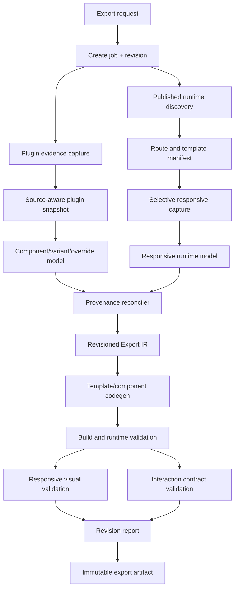

# CodeRelay Responsive and Source-Aware Export Implementation Plan

## Status

Proposed implementation plan.

This plan combines:

1. selective responsive capture and template-level regeneration
2. source-aware component, variant, override, and Code File reconstruction

It also introduces a revision workflow so existing exports can be improved without restarting the entire export and so future exports capture the required evidence correctly on their first run.

## Executive Summary

CodeRelay now produces a substantial React/Vite export with valid routes, CMS data, generated TSX, generated CSS, build validation, and runtime validation. The next phase must improve responsiveness and behavior without discarding that progress.

The implementation will make five architectural changes:

1. **Correct responsive capture at the source.**
   Every viewport must be created and verified at its intended width. An export must fail preflight if desktop, laptop, tablet, and mobile captures collapse to the same width.

2. **Capture responsive templates rather than repeatedly capturing every CMS item.**
   Static pages receive complete breakpoint capture. CMS routes are grouped by template and receive one or more representative responsive captures, while every CMS item retains its content and route data.

3. **Capture component and Code File semantics from the Framer plugin.**
   CodeRelay will recursively collect component variants, breakpoint replicas, inherited traits, controls, gestures, component instances, Code File source, exports, and override assignments where the API exposes them.

4. **Generate behavior from explicit evidence.**
   Code Components and Overrides will be adapted from source where compatible. Design-component variants will become typed React state machines. Runtime interaction replay will be used only when source or plugin semantics are insufficient.

5. **Make every export revisioned and incremental.**
   Captures, normalized intermediate representations, generated modules, validation results, and reports will be content-addressed. A new revision reuses every unchanged artifact and recomputes only invalid stages.

The existing Famasi job can become revision 2. Its desktop capture, routes, CMS, assets, text, generated files, and validation evidence remain reusable. Only malformed responsive evidence and missing source-aware component evidence need collection again.

---

## Product Goals

### Primary goals

- Generate full-width page shells with correctly constrained inner containers.
- Preserve Framer breakpoint behavior across desktop, laptop, tablet, and mobile.
- Preserve component variants and interactions where evidence is available.
- Preserve compatible Code Components and Code Overrides as executable React.
- Preserve CMS as data plus shared route templates instead of duplicating every item into unrelated static components.
- Improve an existing export as a new revision without repeating unaffected capture or generation work.
- Make future exports correct-by-default so selective recapture is a recovery tool, not the normal workflow.

### Secondary goals

- Reduce export duration for large CMS sites.
- Reduce generated source size and CSS duplication.
- Reduce lazy-route loading flashes.
- Improve route behavior, asset portability, font selection, and diagnostics.
- Produce an explicit fidelity and capability report for every page template and component.

### Non-goals for this phase

- Reimplement every Framer-managed hosting feature.
- Guarantee compatibility for arbitrary third-party browser scripts.
- Execute destructive interactions during automated behavior discovery.
- Reverse engineer unavailable private Framer implementation source.
- Convert every animation into hand-authored semantic motion immediately.
- Replace the existing exporter with static HTML capture.

---

## Confirmed Problems

### Responsive capture defect

The current full-site capture creates a `BrowserContext`, then calls:

```ts
context.newPage({ viewport })
```

Viewport options belong to `Browser.newPage(...)` or context creation. They are not applied by `BrowserContext.newPage()`.

The result in the completed Famasi export is:

- desktop capture width: 1280
- laptop capture width: 1280
- tablet capture width: 1280
- mobile capture width: 1280

This produces:

- fixed `width: 1280px` page roots
- fixed full-page heights
- missing breakpoint deltas
- invalid media queries such as `(min-width: 1281px) and (max-width: 1280px)`
- no reliable mobile stacking evidence
- false-positive responsive validation

### Component behavior defect

The current export contains:

- component identifiers and insertion URLs
- Code File names and paths
- some component controls
- some `isVariant`, `isPrimaryVariant`, `gesture`, and inheritance attributes
- runtime hover and focus style samples

It does not currently preserve:

- Code File source content
- recursive component variant families
- transition edges between variants
- event triggers
- override source and assignments
- component-local state
- click/tap interaction outcomes
- complete motion timelines
- runtime dependency compatibility

The generated page modules consequently contain no state or event handlers.

### Scalability defect

The current pipeline captures and generates each CMS item as a complete independent page.

For the Famasi job this creates:

- 176 routes
- 556 generated files
- approximately 45.7 MB of TSX
- approximately 34.7 MB of CSS
- hundreds of duplicated route bundles
- long build and validation times

CMS content must remain complete, but common route structure should be represented by shared templates.

### Incrementality defect

The route cache now prevents repeated network capture, but incrementality is incomplete:

- capture cache keys do not fully encode capture schema and viewport correctness
- generation is repeated for all routes
- reports do not explain cache hits and invalidations
- revisions are not first-class user-visible entities
- source-aware plugin evidence cannot be attached to an existing export as a new revision

---

## Official Framer API Boundary

The implementation must use the current installed `framer-plugin` types as the compile-time authority and verify behavior against official Framer documentation.

Relevant supported evidence includes:

- node identity and hierarchy
- `getChildren()` and `getRect()`
- component and component-instance node traits
- breakpoint and variant traits
- primary and replica identity
- inherited attributes
- layout constraints
- component controls
- gesture state
- links
- Code Files
- Code File `content`
- Code File exports
- Code File versions
- CMS collection fields and items
- project and publish information

Important limitation:

Framer does not provide a supported full-site source export. Plugin node metadata is not equivalent to resolved browser CSS or complete published React source. Runtime DOM and computed-style capture remain required for visual truth.

Code Components may depend on:

- the `framer` runtime package
- `RenderTarget`
- Framer property-control APIs
- Framer-specific module aliases
- browser-only globals
- external packages
- project-local modules

Every Code Component must therefore go through compatibility analysis and adaptation rather than being copied blindly.

---

## Target Architecture



### Core rule

No stage should depend solely on timestamps or directory names.

Each stage must compute an input fingerprint and produce an immutable artifact manifest. If the fingerprint has not changed, the artifact is reused.

---

## Revision Model

### Job and revision relationship

A job represents the source project and export intent.

A revision represents one reproducible realization of that job.

Example:

```text
job_042076bbe22a7e55
├── revision_0001
│   ├── status.json
│   ├── manifests/
│   ├── capture/
│   ├── ir/
│   ├── generated/
│   ├── validation/
│   └── export.zip
└── revision_0002
    ├── parent.json
    ├── invalidation-plan.json
    ├── manifests/
    ├── capture/
    ├── ir/
    ├── generated/
    ├── validation/
    └── export.zip
```

### Revision metadata

```ts
type ExportRevision = {
  id: string
  jobId: string
  parentRevisionId?: string
  reason:
    | "initial-export"
    | "responsive-improvement"
    | "component-source-refresh"
    | "interaction-improvement"
    | "manual-regeneration"
    | "schema-upgrade"
  status:
    | "queued"
    | "planning"
    | "capturing"
    | "generating"
    | "validating"
    | "completed"
    | "failed"
  sourceFingerprint: string
  captureSchemaVersion: string
  irSchemaVersion: string
  codegenVersion: string
  inheritedArtifacts: ArtifactReference[]
  invalidatedArtifacts: ArtifactInvalidation[]
  createdAt: string
  updatedAt: string
}
```

### User-facing revision actions

- **Improve responsiveness**
- **Improve components and interactions**
- **Refresh changed Framer project**
- **Regenerate with latest exporter**
- **Revalidate only**
- **Download previous revision**
- **Compare revisions**

### Invalidation planning

Before doing work, CodeRelay writes:

```json
{
  "parentRevision": "revision_0001",
  "reused": [
    "plugin/cms",
    "runtime/desktop/routes/*",
    "assets/manifest",
    "routes/manifest"
  ],
  "invalidated": [
    {
      "artifact": "runtime/responsive/*",
      "reason": "viewport-capture-schema-v2"
    },
    {
      "artifact": "components/source-model",
      "reason": "code-file-content-not-captured"
    },
    {
      "artifact": "generated/css/*",
      "reason": "depends-on-responsive-model"
    }
  ]
}
```

The UI must show this plan before starting.

---

## Content-Addressed Artifact Store

### Artifact key

```ts
type ArtifactKeyInput = {
  artifactType: string
  schemaVersion: string
  sourceFingerprint: string
  routePath?: string
  templateId?: string
  componentId?: string
  viewport?: string
  inputHashes: string[]
}
```

Hash the canonical JSON representation with SHA-256.

### Required artifact categories

- plugin project snapshot
- plugin node graph
- component catalog
- component variant graph
- Code File snapshot
- override assignment graph
- CMS schema
- CMS item data
- route manifest
- template manifest
- runtime route capture by viewport
- interaction replay trace
- normalized responsive model
- normalized component model
- route IR
- template IR
- generated component module
- generated page module
- generated stylesheet
- build result
- visual comparison result
- interaction test result
- final export package

### Cache validity

An artifact is reusable only when:

- schema version matches
- source URL/project fingerprint matches
- required viewport dimensions match exactly
- capture completed successfully
- capture validation passed
- referenced assets still exist locally
- dependent artifact hashes match

Never treat “file exists” as sufficient cache validity.

---

## Phase 0: Safety and Observability Foundation

### Objective

Prevent another long export from silently collecting invalid evidence.

### Tasks

1. Add explicit pipeline stages to job progress:
   - planning
   - plugin snapshot
   - route discovery
   - template classification
   - responsive capture
   - component analysis
   - interaction replay
   - IR reconciliation
   - code generation
   - dependency installation
   - build
   - runtime validation
   - responsive validation
   - interaction validation
   - packaging

2. Add stage-specific progress:
   - current template
   - current route
   - current viewport
   - current component
   - completed/total
   - cache hits
   - fresh captures
   - failures
   - estimated remaining work

3. Add structured event logs:

```ts
type PipelineEvent = {
  revisionId: string
  stage: string
  event: string
  entityType?: "route" | "template" | "component" | "code-file"
  entityId?: string
  viewport?: string
  durationMs?: number
  cacheStatus?: "hit" | "miss" | "invalid"
  details?: Record<string, unknown>
}
```

4. Persist exceptions with:
   - stage
   - entity
   - input fingerprint
   - retryability
   - partial artifacts

5. Never print full route validation arrays in one console line.

6. Keep the last successful revision downloadable while a new revision runs.

### Acceptance criteria

- The jobs page never reports only “running” for a multi-minute stage.
- A failed revision does not replace or hide the prior successful revision.
- Every stage reports cache reuse and fresh work.
- A nonessential debug artifact cannot fail a validated export.

---

## Phase 1: Correct Responsive Capture From Scratch

### Objective

Make future initial exports collect correct breakpoint evidence on the first run.

### Capture implementation

Refactor page creation so viewport dimensions are applied explicitly:

```ts
const context = await browser.newContext()
const page = await context.newPage()
await page.setViewportSize(viewport)
```

Alternatively, create one context per viewport:

```ts
const context = await browser.newContext({ viewport })
const page = await context.newPage()
```

Use one strategy consistently.

### Required viewport manifest

```ts
const REQUIRED_VIEWPORTS = {
  desktop: { width: 1440, height: 900 },
  laptop: { width: 1280, height: 900 },
  tablet: { width: 768, height: 1024 },
  mobile: { width: 390, height: 844 },
} as const
```

Allow project-specific breakpoint values when plugin evidence provides them, while retaining canonical validation viewports.

### Runtime verification

Immediately after page creation, record:

```ts
const observedViewport = await page.evaluate(() => ({
  innerWidth: window.innerWidth,
  innerHeight: window.innerHeight,
  clientWidth: document.documentElement.clientWidth,
  devicePixelRatio: window.devicePixelRatio,
}))
```

Hard fail the viewport capture when:

- `innerWidth !== requested.width`
- `clientWidth` differs unexpectedly
- two named viewports share the same observed width
- screenshot width differs from the intended capture mode

### Responsive evidence

For each captured node and viewport, record:

- stable runtime node identity
- DOM path
- parent identity
- bounding rectangle
- computed display
- position mode
- width/height
- min/max dimensions
- margin and padding
- flex direction and wrapping
- grid tracks and placement
- alignment
- gap
- visibility
- overflow
- typography
- image object fit
- transform
- opacity
- z-index
- source-order index

### Stable cross-viewport matching

DOM index alone is insufficient.

Build a weighted identity key using:

- `data-framer-name`
- stable Framer class tokens
- semantic tag
- text signature
- asset signature
- parent identity
- sibling role
- href
- component marker
- DOM path as fallback

Record match confidence and unmatched nodes.

### Full-width shell normalization

The reconciler must distinguish:

- viewport shell
- full-bleed section
- centered max-width container
- content column
- fixed-size media
- absolute decorative layer

Rules:

1. `body`, root, page, and full-bleed sections default to `width: 100%`.
2. A measured viewport-width node must not emit a fixed pixel width unless evidence proves it is intentionally fixed.
3. Inner containers retain measured `max-width`.
4. Centered containers emit `width: 100%`, `max-width`, and auto horizontal margins.
5. Root measured height is not emitted as fixed `height`; use content flow or `min-height`.
6. Fixed/absolute positioning is retained only when parent and anchor evidence support it.

### Breakpoint inference

Generate responsive rules from observed deltas:

- width change
- flex direction change
- grid column change
- visibility change
- reordered content
- padding/gap change
- typography scale
- alignment change
- position mode change

Do not emit a media query when:

- min width exceeds max width
- all viewport widths are identical
- the rule contains no meaningful delta
- it simply repeats the base style

### Capture preflight gate

Before route generation, assert:

```text
desktop = 1440
laptop = 1280
tablet = 768
mobile = 390
```

The export cannot continue with a warning if this gate fails.

### Tests

- BrowserContext viewport regression test.
- Distinct viewport width test.
- Responsive flex row-to-column fixture.
- Full-width shell/max-width container fixture.
- Hidden desktop/mobile navigation fixture.
- Grid column reduction fixture.
- Fixed decorative layer fixture.
- Invalid media query prevention test.
- Root fixed-height prevention test.

### Acceptance criteria

- No generated page root uses the observed desktop viewport as a fixed width.
- No impossible media query is generated.
- At least one responsive fixture changes layout at every expected breakpoint.
- Mobile screenshots have the expected pixel width.
- Source and generated previews are compared at all four valid viewport widths.

---

## Phase 2: Route Template Classification

### Objective

Avoid recapturing and regenerating the same layout for every CMS item.

### Route classes

Classify routes as:

- static page
- CMS index
- CMS detail
- redirect
- utility/external handoff
- error page
- duplicate alias
- unknown

### Template identity

Create a structural signature from:

- normalized DOM tag tree
- stable Framer component markers
- class token families
- data-framer names
- CMS collection ID
- repeated layout skeleton
- text removed or replaced with typed placeholders
- asset URLs replaced with asset roles

Routes with sufficiently similar structural signatures belong to one template.

### Template manifest

```ts
type RouteTemplate = {
  id: string
  kind: "static" | "cms-index" | "cms-detail" | "redirect" | "utility"
  collectionId?: string
  routePattern: string
  representativeRoutes: string[]
  memberRoutes: string[]
  structuralFingerprint: string
  responsiveCapturePolicy: "all-viewports" | "representative-viewports"
  confidence: number
}
```

### Representative selection

For each CMS template, select:

- shortest-content item
- longest-content item
- item with the richest media
- item with optional fields missing

Capture the primary representative at all viewports.

Capture additional representatives only when content affects layout materially.

### Static pages

Static pages continue to receive complete responsive capture because their layouts may be unique.

### Redirects

Redirect routes generate route metadata:

```ts
{ from: "/twitter", to: "https://twitter.com/...", status: 302 }
```

Do not generate a visual placeholder React page unless explicitly requested.

### Acceptance criteria

- CMS collection items remain complete in exported data.
- Repeated CMS items share one generated route template.
- The route manifest maps every original route to a template and data record.
- Redirect routes behave as redirects.
- Template grouping confidence is visible in the report.

---

## Phase 3: Selective Responsive Recapture

### Objective

Repair existing jobs without full recapture and make selective recapture available for future revisions.

### Existing Famasi revision plan

Reuse:

- source URL and project identity
- route manifest
- desktop runtime captures
- CMS schemas and items
- asset manifest
- text and media evidence
- generated route names
- CodeRelay validation history

Invalidate:

- laptop capture
- tablet capture
- mobile capture
- viewport dimensions in cached desktop metadata where incorrect
- responsive node matches
- responsive style deltas
- generated responsive CSS
- responsive visual comparisons

Fresh work:

- correct static-page breakpoint capture
- representative CMS-template breakpoint capture
- responsive reconciliation
- affected CSS generation
- responsive validation

### Selective recapture API

```ts
type RecaptureRequest = {
  parentRevisionId: string
  reason: string
  routes?: string[]
  templateIds?: string[]
  componentIds?: string[]
  viewports?: ViewportName[]
  stages?: PipelineStage[]
}
```

### Reuse behavior

If a desktop capture is valid:

- retain desktop DOM and styles
- retain text, assets, and route content
- attach fresh non-desktop evidence
- rerun only cross-viewport reconciliation and dependent generation

If a template representative is recaptured:

- regenerate template CSS
- regenerate shared template component
- reuse all member CMS data
- rerun member-route smoke validation

### Cache schema migration

Old cache entries must not silently pass.

Each capture artifact needs:

```ts
{
  schemaVersion: "runtime-capture-v2",
  requestedViewport: { "width": 390, "height": 844 },
  observedViewport: { "innerWidth": 390, "innerHeight": 844 },
  valid: true
}
```

Entries without this evidence are invalid for responsive generation.

### Acceptance criteria

- Improving the Famasi export does not recapture unchanged desktop content.
- CMS member routes do not each require four fresh page captures.
- A revision report states exactly which artifacts were reused.
- Interrupted recapture resumes from valid per-template/per-viewport artifacts.

---

## Phase 4: Source-Aware Plugin Capture

### Objective

Capture enough Framer authoring semantics to reconstruct components and behavior.

### Code File capture

Update `sanitizeCodeFile` to collect:

- ID
- name
- path
- current content
- exports
- export type
- insertion URL
- default-export status
- version metadata
- lint result when useful
- typecheck result when useful
- content hash

Do not truncate source content in the plugin payload without an explicit size strategy.

For large source payloads:

- upload Code Files as separate artifacts
- reference them by hash in the job payload
- show per-file capture status

### Recursive component graph

For every ComponentNode and relevant instance:

1. collect root traits
2. recursively collect children
3. record parent/child order
4. record `getRect()`
5. record layout traits
6. record variant traits
7. record primary/replica identity
8. record `inheritsFromId`
9. record gesture state
10. record component identifier
11. record instance controls
12. record links
13. record text and style references
14. record breakpoint identity

### Component family model

```ts
type FramerComponentFamily = {
  id: string
  name: string
  primaryVariantId: string
  variants: Array<{
    id: string
    name: string
    gesture?: string
    inheritsFromId?: string
    nodeTreeArtifact: string
  }>
  instances: Array<{
    nodeId: string
    routePath?: string
    controls: Record<string, unknown>
    initialVariantId?: string
  }>
  transitions: ComponentTransition[]
  provenance: "plugin" | "runtime" | "source" | "merged"
}
```

### Transition evidence

Capture transition edges from:

- plugin-exposed gesture/variant traits
- component naming conventions only as low-confidence hints
- runtime event replay
- Code Component source
- override source

Never invent an event edge solely because two variants exist.

### Override assignment graph

Capture:

- Code File export type `"override"`
- override source
- target node/component assignment where exposed
- affected props
- required dependencies

If assignment is not exposed:

- preserve override source
- mark assignment unresolved
- use runtime replay to infer effects

### Permissions and capability report

The plugin must report:

- Code File API available
- source content readable
- components readable
- CMS readable
- styles readable
- permission failures
- unsupported node types
- truncated artifacts

Missing source evidence must be explicit, not represented as an empty successful list.

### Tests

- Code File content capture.
- component export metadata capture.
- override export capture.
- recursive component tree capture.
- primary/replica inheritance capture.
- controls capture.
- payload size/chunking test.
- permission-denied diagnostic test.

### Acceptance criteria

- Every readable Code File has a source artifact.
- Every component family has a primary variant and known replicas.
- Missing transitions are reported as unknown.
- Source capture can be attached to an existing job revision without runtime recapture.

---

## Phase 5: Code Component Compatibility and Adaptation

### Objective

Turn compatible Framer Code Files into executable exported React modules.

### Compatibility analyzer

Parse each Code File with the TypeScript compiler API.

Classify imports:

- React
- `framer`
- `framer-motion`
- project-local
- npm package
- Framer internal alias
- unsupported remote module

Detect:

- Code Component exports
- Override exports
- property controls
- `RenderTarget`
- browser globals
- dynamic imports
- CSS imports
- local component imports
- unsupported Framer internals

### Compatibility levels

```ts
type Compatibility =
  | "portable"
  | "portable-with-adapter"
  | "portable-with-dependencies"
  | "runtime-fallback-required"
  | "unsupported"
```

### Adapter layer

Create a small exported compatibility package for supported Framer APIs:

- `RenderTarget.current()` returns preview/runtime context
- safe property-control no-ops where controls are editor-only
- supported motion exports map to `framer-motion`
- image/control values normalize to exported asset records

Do not emulate APIs without tests.

### Dependency handling

- resolve declared npm imports
- pin exact compatible versions
- reject unresolved project aliases with diagnostics
- map project-local imports to captured Code Files
- include a dependency license report

### Render-target validation

Render adapted components in:

- server/build context when supported
- browser preview
- target page context

Compare against published runtime snapshots.

### Fallback behavior

If adaptation fails:

- retain static visual subtree
- retain component metadata and source in `unadapted-components/`
- report the failure
- optionally invoke runtime interaction replay

The entire export must not fail because one component is unsupported.

### Acceptance criteria

- Portable Code Components execute outside Framer.
- unsupported components degrade visibly and explicitly.
- no unresolved import reaches the final build.
- behavior tests cover `RenderTarget` differences.

---

## Phase 6: Design Component Variant Reconstruction

### Objective

Generate reusable React components with explicit variant state.

### Variant props

Generate typed variant props:

```ts
type Variant = "Default" | "Open" | "Success"

type ComponentProps = {
  initialVariant?: Variant
  controlledVariant?: Variant
  onVariantChange?: (variant: Variant) => void
}
```

### State machine

For known transitions:

```ts
type Transition = {
  from: Variant
  event: "click" | "tap" | "hover-start" | "hover-end" | "focus" | "timeout"
  to: Variant
  transition?: MotionTransition
}
```

Generate state only when transition evidence exists.

### Structural reconciliation

Variants may differ in:

- visibility
- content
- child count
- layout
- color
- size
- transform
- assets

Generate:

- shared stable structure
- conditional branches for structural differences
- CSS variables for style-only differences
- motion transitions for supported deltas

### Accessibility

Map stateful controls to appropriate semantics:

- accordion: `button`, `aria-expanded`, controlled panel
- tabs: tab roles and keyboard navigation
- modal: dialog semantics and focus management
- carousel: labeled controls and reduced-motion behavior
- menu: button state and navigation semantics

Do not infer a semantic widget without adequate evidence.

### Acceptance criteria

- Known component variant interactions are executable.
- initial state matches the published page.
- keyboard behavior is present for recognized widget patterns.
- unknown transitions are reported rather than guessed.

---

## Phase 7: Safe Runtime Interaction Replay

### Objective

Fill behavior gaps when plugin/source evidence is incomplete.

### Safe interaction policy

Default allowed actions:

- hover
- focus
- click on non-navigation buttons
- click on local variant controls
- keyboard activation
- open/close menus
- accordion toggles
- tab selection

Default blocked actions:

- form submission
- purchase/payment
- authentication
- file upload
- destructive account actions
- external navigation
- `mailto:`/`tel:`
- unknown script-driven actions

### Replay record

For each action:

- before DOM signature
- before computed styles
- before screenshot
- event
- after DOM signature
- after computed styles
- after screenshot
- URL change
- network activity summary
- console errors
- animation samples

### State graph synthesis

Build a finite state graph from stable DOM/style deltas.

Merge replay evidence with plugin/source evidence using provenance and confidence.

### Acceptance criteria

- replay never submits or mutates external state by default
- every synthesized transition points to evidence
- replay failures do not fail static export
- unsupported behavior is listed in the fidelity report

---

## Phase 8: Responsive and Component-Aware IR

### Objective

Replace snapshot-shaped codegen input with semantic, provenance-aware models.

### Responsive layout model

```ts
type ResponsiveLayoutNode = {
  id: string
  role:
    | "page-shell"
    | "full-bleed-section"
    | "max-width-container"
    | "stack"
    | "grid"
    | "content"
    | "media"
    | "decoration"
  base: LayoutStyle
  overrides: Partial<Record<ViewportName, Partial<LayoutStyle>>>
  evidence: EvidenceReference[]
  confidence: number
}
```

### Component behavior model

```ts
type ComponentBehaviorModel = {
  componentId: string
  implementation:
    | "adapted-code-component"
    | "generated-variant-machine"
    | "static-runtime-fallback"
  variants: VariantModel[]
  transitions: TransitionModel[]
  controls: ControlModel[]
  dependencies: DependencyModel[]
  evidence: EvidenceReference[]
  confidence: number
}
```

### Provenance precedence

Use:

1. Code File source for authored Code Component behavior
2. plugin variant and component traits for design semantics
3. runtime interaction replay for observed behavior
4. runtime computed styles for visual state
5. heuristic inference only when marked low-confidence

### Acceptance criteria

- codegen does not read raw capture objects directly
- every responsive override has evidence
- every generated transition has evidence
- low-confidence decisions are reportable and revisable

---

## Phase 9: Incremental Code Generation

### Objective

Regenerate only artifacts affected by a revision.

### Module boundaries

Generate:

- shared page shell
- shared navigation/footer
- shared design components
- adapted Code Components
- one module per static route
- one module per CMS template
- CMS data modules
- route manifest
- redirect manifest
- shared responsive tokens
- page/template-specific responsive CSS

### Generation fingerprint

Each generated module hash depends on:

- template/component IR hash
- codegen version
- dependency adapter version
- style token hash
- relevant CMS schema hash

Content-only CMS changes must not regenerate template CSS.

### CSS strategy

Prefer:

- fluid shell rules
- max-width container tokens
- CSS custom properties
- shared breakpoint definitions
- semantic stack/grid rules
- minimal viewport overrides

Avoid:

- repeating computed defaults
- fixed viewport root widths
- fixed content-derived heights
- per-node CSS when shared component CSS is possible
- duplicated CMS item styles

### Routing

Replace render-time-only path lookup with a real router or reactive history layer.

Requirements:

- direct route load
- back/forward navigation
- internal navigation without full reload
- route-level error boundary
- route prefetch for likely navigation
- explicit redirects
- useful loading shell instead of blank white fallback

### Acceptance criteria

- unchanged generated modules are reused byte-for-byte.
- a template CSS change does not regenerate unrelated pages.
- CMS items use shared templates.
- browser back/forward works.
- route loading does not flash an unstyled blank page.

---

## Phase 10: Validation Gates

### Responsive validation

For each unique template and static page:

- render source at valid desktop/laptop/tablet/mobile widths
- render generated result at the same widths
- compare screenshots
- compare bounding boxes
- compare text wrapping
- compare visible/hidden node sets
- compare layout modes
- detect horizontal overflow

### Required hard failures

- observed source viewport differs from requested viewport
- generated page has unexpected horizontal overflow
- page shell is narrower than viewport without source evidence
- media query range is impossible
- generated root is empty
- route module fails to load
- generated CSS is missing
- template route loses CMS content

### Interaction validation

For every known transition:

- initial state exists
- trigger is executable
- target state appears
- visual delta is within tolerance
- no uncaught exception
- keyboard activation works where required

### Code Component validation

- imports resolve
- typecheck passes
- build passes
- browser render passes
- console errors are recorded
- fallback is used when adaptation fails

### Validation matrix

| Area | Unit | Integration | Browser | Visual |
| --- | --- | --- | --- | --- |
| Viewport creation | Yes | Yes | Yes | No |
| Responsive matching | Yes | Yes | Yes | Yes |
| Template grouping | Yes | Yes | No | Spot check |
| Code File capture | Yes | Plugin fixture | No | No |
| Code adaptation | Yes | Yes | Yes | Yes |
| Variant machine | Yes | Yes | Yes | Yes |
| Interaction replay | Yes | Yes | Yes | Yes |
| Revision reuse | Yes | Yes | No | No |
| Routing | Yes | Yes | Yes | No |
| CMS templates | Yes | Yes | Yes | Yes |

---

## Phase 11: Product and Plugin User Experience

### Initial export flow

1. Choose export mode.
2. Show source and publish URL.
3. Run capability preflight.
4. Show expected:
   - static pages
   - CMS templates
   - CMS items
   - components
   - Code Files
   - responsive captures
5. Start export.
6. Show stage progress and cache status.
7. Present final capability/fidelity report.

### Improve existing export flow

1. Open completed job.
2. Select **Create improved revision**.
3. Choose:
   - responsiveness
   - components/interactions
   - both
4. Show reuse plan:
   - artifacts reused
   - artifacts recaptured
   - estimated routes/templates
   - expected time
5. Start revision.
6. Keep prior revision available.
7. Show before/after comparison.

### Report language

Avoid claiming “complete fidelity” from build success.

Report separately:

- build validity
- route validity
- desktop fidelity
- responsive fidelity
- interaction fidelity
- Code Component portability
- CMS completeness
- asset portability

---

## Data Migration for Existing Jobs

### Migration command

Add:

```bash
npm run export:migrate-job -- --job job_042076bbe22a7e55
```

### Migration behavior

1. Discover latest successful artifact.
2. Register it as `revision_0001`.
3. Import route/cache manifests.
4. fingerprint existing captures.
5. mark responsive captures invalid if observed widths are absent or duplicated.
6. import CMS and assets as reusable artifacts.
7. import generated files as revision output.
8. create a revision report.

### Famasi migration result

Expected:

```text
Reusable:
- 176 route identities
- valid desktop content captures
- 2 CMS collections
- CMS items
- asset references
- component catalog
- generated desktop baseline

Invalid:
- laptop responsive evidence
- tablet responsive evidence
- mobile responsive evidence
- responsive media queries
- component source snapshots
- interaction state graphs
```

---

## File-Level Implementation Map

### Plugin

`apps/plugin/src/App.tsx`

- collect Code File content and exports
- recursively capture component nodes
- capture variant/replica traits
- capture controls and gestures
- chunk large source artifacts
- expose capability diagnostics
- add revision/improvement UI

### Worker

`apps/worker/src/index.ts`

- process revision records
- persist stage progress
- calculate invalidation plans
- reuse content-addressed artifacts
- keep prior revision available
- support resumable revision execution

### Capture

`packages/exporter-core/src/capture.ts`

- correct viewport creation
- verify observed viewport
- version runtime captures
- capture per-template/per-viewport artifacts
- stable cross-viewport matching evidence
- interaction replay
- redirect classification

### Local export orchestration

`packages/exporter-core/src/local-export.ts`

- revision orchestration
- template capture planning
- stage fingerprints
- selective invalidation
- incremental generation
- validation gates
- revision reports

### Intermediate representation

`packages/exporter-core/src/ir.ts`

- responsive semantic layout model
- route template model
- component family model
- behavior state graph
- provenance and confidence

### Code generation

`packages/codegen/src/next-project.ts`

- fluid page shells
- max-width containers
- valid responsive CSS
- shared CMS templates
- component state machines
- adapted Code Components
- real routing
- redirects
- shared modules and styles

This file should be decomposed during implementation into:

```text
packages/codegen/src/
├── project/
├── routing/
├── responsive/
├── components/
├── cms/
├── motion/
└── adapters/
```

### Shared types

`packages/shared/src/types.ts`

- revision types
- artifact types
- capture schema versions
- template types
- component behavior types
- validation types

### Fidelity

`packages/fidelity/src/compare.ts`

- valid source/generated viewport comparison
- horizontal overflow checks
- text-wrap comparison
- interaction state comparison
- template/member-route sampling

### Web UI

`apps/web/app/jobs/`

- revision list
- create-improvement flow
- invalidation preview
- stage progress
- before/after report
- prior revision downloads

---

## Delivery Order

### Milestone 1: Responsive correctness

- viewport bug fix
- capture schema v2
- hard viewport validation
- fluid shell normalization
- valid breakpoint generation
- responsive tests

Exit criterion:

A simple responsive Framer page exports correctly from scratch without recapture.

### Milestone 2: Revisions and selective capture

- revision records
- artifact fingerprints
- invalidation planner
- template classification
- selective responsive capture
- existing-job migration

Exit criterion:

Famasi revision 2 reuses desktop/CMS/assets and recaptures only required responsive templates.

### Milestone 3: Plugin source model

- Code File source capture
- recursive component capture
- variant/replica graph
- override export capture
- capability report

Exit criterion:

A fixture project exports complete source and variant evidence.

### Milestone 4: Component adaptation and state

- compatibility analyzer
- Framer adapter
- variant state machine codegen
- fallback behavior
- interaction tests

Exit criterion:

A component with three variants and click transitions behaves correctly in exported React.

### Milestone 5: Runtime replay

- safe action policy
- state diffing
- transition graph merge
- interaction fidelity report

Exit criterion:

A source-inaccessible interactive component exports with evidence-backed state transitions.

### Milestone 6: Scale and polish

- CMS shared templates
- incremental codegen
- route prefetch/loading UX
- asset localization
- used-font filtering
- performance budgets

Exit criterion:

Large CMS exports are materially smaller and faster while preserving route/content completeness.

---

## Test Fixtures

Create controlled Framer fixtures for:

1. full-width page with max-width inner container
2. desktop row that stacks on mobile
3. desktop navigation replaced by mobile menu
4. grid changing from four to two to one column
5. absolute decorative elements inside fluid sections
6. accordion component variants
7. tab component variants
8. carousel variants
9. Code Component using React only
10. Code Component using `RenderTarget`
11. Code Component with local imports
12. Code Override changing opacity
13. Code Override handling click
14. CMS index and detail template
15. CMS items with missing optional fields
16. external redirect
17. unsupported third-party component

Every fixture must have:

- expected plugin snapshot
- expected runtime capture
- expected responsive model
- expected component model
- expected generated files
- source screenshots
- generated screenshots
- interaction contract

---

## Performance Budgets

Initial targets:

- plugin snapshot under 60 seconds for ordinary projects
- cache lookup under 2 seconds per 1,000 artifacts
- representative template classification under 30 seconds for 250 routes
- no more than four responsive captures per unique static/template layout by default
- no repeated responsive capture for every CMS item
- incremental revision skips all unchanged capture
- generated CSS should not duplicate a CMS template per item
- route navigation should not show a blank white screen

Large project budgets must be configurable and visible before execution.

---

## Risks and Mitigations

### Framer API changes

Mitigation:

- pin SDK
- compile against installed types
- capability-detect APIs
- version plugin snapshots
- maintain plugin API contract tests

### Code File payload size

Mitigation:

- chunk source artifacts
- hash/deduplicate
- upload separately
- avoid storing source in job JSON

### Unsafe interaction replay

Mitigation:

- strict allowlist
- block form submission/navigation
- intercept requests
- sandbox replay context
- require opt-in for risky actions

### Incorrect template grouping

Mitigation:

- confidence threshold
- multiple representatives
- member-route smoke checks
- split template groups automatically on validation divergence

### Unsupported Code Components

Mitigation:

- compatibility classification
- per-component fallback
- preserve source and diagnostics
- do not fail whole export

### Stale cache

Mitigation:

- schema versions
- source fingerprints
- observed viewport validation
- dependency hashes
- explicit invalidation report

### Heuristic responsive overcorrection

Mitigation:

- prefer observed breakpoint deltas
- retain provenance
- visual comparison
- do not convert intentional fixed media into fluid layout without evidence

---

## Definition of Done

### Future initial exports

A new export is done only when:

- all requested viewports report their intended dimensions
- page shell width behavior matches source
- responsive stacking/visibility deltas are preserved
- no impossible media query exists
- readable Code File source is captured
- component variant evidence is modeled
- CMS uses shared templates where appropriate
- build passes
- all routes mount
- responsive validation passes at all required viewports
- interaction contracts pass for all supported interactions
- unsupported behavior is explicitly reported

### Existing export improvement

An improvement revision is done only when:

- parent revision remains downloadable
- reuse/invalidation plan is recorded
- unchanged artifacts are cache hits
- only invalid evidence is recaptured
- affected modules are regenerated
- before/after report is available
- revised export passes the same first-class validation gates

### Famasi-specific completion target

- full-width root at every viewport
- max-width inner containers retained
- no horizontal overflow at 390px
- navigation and major grids adapt at mobile/tablet widths
- known interactive components expose working states
- CMS routes use shared templates
- redirect routes redirect
- route loading does not flash blank white
- revision 2 reuses revision 1 route/CMS/asset evidence wherever valid

---

## Recommended Implementation Decision

Implement in this order:

1. viewport correctness and hard validation
2. revision/artifact model
3. route template grouping and selective responsive recapture
4. plugin Code File content and recursive variant capture
5. source compatibility/adaptation
6. design-component state machines
7. safe runtime replay
8. incremental template/component codegen
9. comprehensive responsive and interaction validation

This ordering ensures future exports stop producing malformed responsive evidence immediately, while the revision system allows the existing Famasi export to be improved without restarting from zero.
