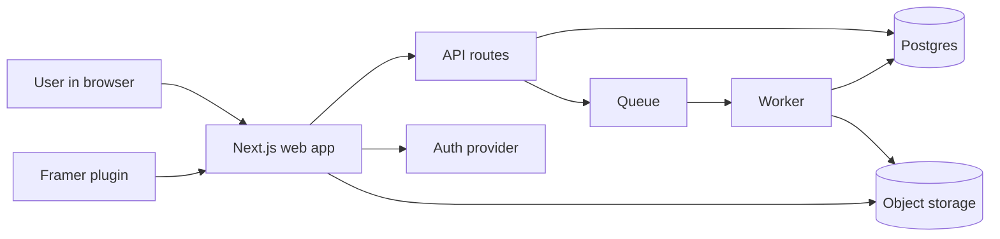

# Code Relay Public Hosting Roadmap

Date: 2026-07-28

## Why this doc exists

Right now Code Relay is a working internal tool, but it is still wired like a local desktop system:

- the web app writes jobs to local disk;
- the worker scans local files and writes artifacts to local disk;
- the Framer plugin talks to localhost-only API endpoints;
- there is no user account model;
- there is no shared queue or shared storage layer.

That means it is not yet safe or practical to give to other people as a hosted product.

This doc explains:

- what exists today;
- what “hosted” actually means for this codebase;
- what has to change before real users can use it in a browser;
- the edge cases that will break a first deployment if we ignore them;
- a sane rollout order so this does not turn into a giant rewrite.

## Current State

The repo already has a browser-facing surface:

- `apps/web` is a Next.js dashboard.
- `apps/web/app/api/jobs/route.ts` accepts new jobs and lists them.
- `apps/web/app/jobs/[id]/page.tsx` shows job details and artifacts.
- `apps/worker/src/index.ts` runs the export pipeline in a separate process.
- `apps/plugin` is the Framer plugin entry point.

But the storage model is still local:

- `apps/web/lib/jobs-store.ts` stores job records under `.coderelay/jobs`.
- `apps/worker/src/index.ts` stores exports under `.coderelay/artifacts`.
- the worker claims jobs by scanning JSON files on disk.
- the API routes only allow localhost origins.

So the current system is closer to:

```text
Framer plugin / browser
        ↓
Next.js dashboard
        ↓
local JSON files
        ↓
local worker process
        ↓
local artifact files
```

That is fine for a single developer machine. It is not enough for a public SaaS.

## What “Hosted” Means

When people say “host this tool”, they usually mean:

- they can open a website in a browser;
- they can sign in;
- they can submit a job without running the app locally;
- the backend keeps running even if their laptop closes;
- job history and artifacts are still there tomorrow;
- multiple users can use the system at the same time;
- one user cannot see another user’s data;
- exports continue to work even if one worker crashes.

For Code Relay, that means the hosted version must separate into at least five concerns:

1. browser UI
2. API and auth
3. durable job storage
4. durable artifact storage
5. background workers

## Recommended Target Architecture



### What each piece does

- **Next.js web app**: dashboard, job pages, upload forms, artifact previews, status polling.
- **API**: create jobs, update status, list jobs, fetch signed artifact URLs, receive plugin payloads.
- **Postgres**: source of truth for users, jobs, revisions, job events, and artifact metadata.
- **Queue**: hands work from request-time to background execution.
- **Worker**: performs capture, export, validation, retries, and artifact generation.
- **Object storage**: stores large ZIPs, screenshots, reports, previews, and other binary files.
- **Auth provider**: identifies users and organizations.

## What Must Change In The Codebase

### 1. Replace local job files with a database

The current job store reads and writes `.coderelay/jobs/*.json`.

That has to become a database-backed job table.

#### Why this matters

- local files do not sync across app instances;
- serverless deployments cannot rely on writable local disk;
- two web instances can race and overwrite each other;
- job status polling becomes inconsistent if each instance sees a different disk;
- deployments lose job history when the container restarts.

#### Minimum data that belongs in the DB

- job ID
- user ID / org ID
- source URL or plugin source metadata
- export mode
- selector
- job status
- timestamps
- progress state
- error state
- revision links
- artifact metadata
- worker attempt count
- idempotency key

#### Edge cases

- **Duplicate submissions**: a user clicks submit twice or the plugin retries. Use an idempotency key so the same request does not create two jobs.
- **Partial writes**: if the process dies mid-write, the record must still be valid. Use transactions, not ad hoc JSON writes.
- **Out-of-order updates**: a stale worker heartbeat should not overwrite a newer failure or completion status. Use versioning or monotonic timestamps.
- **Stuck running jobs**: if a worker disappears, the job must be re-queued or marked stale after a timeout.
- **Job ownership**: a signed-in user should only see their own jobs unless they are in a shared org/admin view.

### 2. Replace local artifacts with object storage

The worker currently writes outputs to `.coderelay/artifacts/<jobId>`.

That has to become object storage with durable keys and metadata.

#### Why this matters

- ZIPs and screenshots can be large;
- local disk fills up fast;
- artifact downloads need a stable URL;
- previews should remain available even when the worker container is gone.

#### What should go into object storage

- ZIP archives
- preview HTML or preview bundles
- screenshots
- report JSON
- validation output
- resolved request payloads
- compatibility reports
- lineage and revision manifests

#### Edge cases

- **Binary mismatch**: the DB says an artifact exists, but the object is missing. The UI should show “artifact missing” instead of crashing.
- **Very large exports**: downloads should stream, not load the whole file into memory.
- **Orphaned blobs**: a failed job may leave files behind. Have a cleanup policy.
- **Multipart uploads**: if artifacts get large enough, use resumable upload support.
- **Public vs private access**: previews may be safe to show inline, but ZIPs and raw reports should usually be private.

### 3. Replace local worker scanning with a real queue

Today the worker loops over JSON files, claims one, and exports it.

That is a local dev pattern. In production, a queue should hold pending work.

#### Why this matters

- scanning files does not scale well;
- multiple workers can claim the same job unless locking is perfect;
- restarts can lose the “who is running what” state;
- retries and delayed jobs are much easier with a queue.

#### Queue responsibilities

- accept a job ID;
- guarantee at-least-once delivery;
- allow retries with backoff;
- allow dead-letter handling;
- keep a visible status for stuck jobs;
- support worker concurrency limits.

#### Edge cases

- **Double execution**: the same job may be delivered twice. Worker processing must be idempotent or protected by a claim lock.
- **Worker crash mid-export**: job should return to queued/running-stale and continue later.
- **Long exports**: some jobs will take many minutes. Heartbeats and lease renewals are required.
- **Queue backlog**: the UI should show “queued behind N jobs” or at least surface backlog.
- **Poison jobs**: one input may always fail. After N retries, mark failed and keep diagnostics.

### 4. Add auth and tenant isolation

The hosted product needs identity.

#### Minimum auth options

- magic link email
- passwordless email + org invite
- SSO later, if needed

#### Authorization rules

- a user only sees jobs they own or are invited to see;
- the plugin can submit on behalf of a user only if it has a valid session or API key;
- admin endpoints should be separated from user endpoints;
- artifact download URLs should be signed or access-checked.

#### Edge cases

- **Anonymous access**: decide whether anonymous job submission is allowed. If yes, limit it hard.
- **Shared team access**: if multiple people work in one org, define whether jobs are org-wide or user-private by default.
- **Revoked access**: if a user leaves the org, their jobs must still exist, but access should follow org rules.
- **Expired session**: the plugin and web UI should detect auth expiry cleanly and not fail with vague 500s.
- **Token leakage**: never store raw plugin secrets in logs or artifact files.

### 5. Move the plugin off localhost assumptions

The current API CORS logic only trusts localhost origins.

That is not enough for a public service.

#### What needs to happen

- allow the real production frontend origin;
- allow the plugin to authenticate against hosted APIs;
- define whether the plugin talks directly to the hosted service or whether it only sends payloads from the browser session;
- support environment-specific endpoints for dev, staging, and prod.

#### Edge cases

- **Stale CORS config**: staging works, production breaks. Use environment-driven origin lists.
- **Mixed environments**: plugin built against staging should not accidentally submit to prod.
- **Browser extension/webview oddities**: the plugin may use a different origin behavior than the dashboard.

## Data Model You Probably Need

This is the minimum useful shape, not the final schema.

### Users

- id
- email
- name
- auth provider subject
- created_at
- last_seen_at

### Organizations

- id
- name
- plan
- created_at

### Memberships

- org_id
- user_id
- role

### Jobs

- id
- org_id
- user_id
- status
- source_url
- selector
- export_mode
- plugin_capture
- revision_kind
- parent_job_id
- requested_focus
- title
- idempotency_key
- progress_json
- error_message
- attempts
- created_at
- updated_at

### Job attempts

- id
- job_id
- attempt_number
- status
- worker_id
- started_at
- finished_at
- failure_reason
- progress_snapshot

### Artifacts

- id
- job_id
- type
- storage_key
- content_type
- byte_size
- checksum
- created_at

### Job events

- id
- job_id
- event_type
- payload_json
- created_at

## Request Flow

### Job creation

1. User submits a URL or plugin payload.
2. API validates the input.
3. API creates or reuses a job using an idempotency key.
4. API inserts the job into the DB.
5. API enqueues the job ID.
6. UI redirects to the job detail page.

### Worker processing

1. Worker claims a job.
2. Worker marks it running.
3. Worker runs capture/export/validation.
4. Worker writes artifacts to object storage.
5. Worker updates the DB with artifact metadata.
6. Worker marks the job completed or failed.

### Status polling

1. UI loads job page.
2. UI polls the job status endpoint.
3. Job page updates while pending.
4. Artifact links appear when ready.

### Artifact download

1. User clicks an artifact.
2. API checks auth and job ownership.
3. API returns a signed URL or streams the file.
4. Browser downloads or opens the artifact.

## Edge Cases By Area

### Input validation

- invalid URLs
- empty selector values
- unsupported export mode
- malformed plugin payloads
- payloads larger than expected
- unknown fields in plugin data

### Networking

- transient 5xx from source websites
- timeouts during capture
- flaky DNS
- blocked third-party asset hosts
- rate limits from remote sites
- headless browser crashes

### Worker execution

- job exceeds max runtime
- memory spike during large captures
- disk fills up on the worker before upload completes
- browser context leaks
- one bad page freezes a batch export
- retrying after a partially written artifact set

### Storage

- DB record exists but artifact upload fails
- artifact upload succeeds but DB write fails
- stale signed URLs
- checksum mismatch
- object storage lifecycle cleanup removes a still-referenced file

### Security

- user A guesses user B’s job ID
- public artifact links become a data leak
- plugin payload contains secrets or internal URLs
- log files accidentally store source data
- overly broad CORS on API routes

### Product behavior

- a job is completed but preview generation failed
- a job fails after some artifacts were already produced
- a rerun creates a new revision chain
- parent job no longer exists but child revision still does
- the user refreshes the page during a status transition

## Recommended Rollout Plan

### Phase 1: Make the current app deployable

Goal: get the web app online without changing every subsystem at once.

- deploy the Next.js app;
- add a real production domain;
- move config to environment variables;
- keep the current local worker for internal testing only;
- hide or label any path that still depends on local disk.

This phase is useful for validating hosting, routing, auth scaffolding, and basic UI.

### Phase 2: Replace disk with durable storage

Goal: make job data survive restarts.

- move jobs to Postgres;
- move artifact blobs to object storage;
- keep read paths compatible while migrating;
- write a migration script for old `.coderelay/jobs` data.

### Phase 3: Add queue + worker

Goal: decouple request time from export time.

- enqueue job IDs;
- run workers as separate processes;
- add retries and leases;
- add a dead-letter path for poison jobs.

### Phase 4: Add auth and tenancy

Goal: let real users share the system safely.

- sign in;
- create orgs;
- scope jobs and artifacts by org;
- add API keys or session-based plugin auth;
- restrict downloads.

### Phase 5: Harden the public product

Goal: make it dependable.

- rate limits;
- audit logs;
- monitoring;
- tracing;
- stale job recovery;
- artifact cleanup;
- abuse prevention;
- background maintenance jobs.

## Migration Strategy

Do not do a “big bang” rewrite.

Use a bridge migration:

1. keep the local JSON store working;
2. add the DB-backed store beside it;
3. write from the app to the new store first;
4. mirror or import old jobs during the transition;
5. switch reads to the DB;
6. remove the fallback only when everything is stable.

That is safer because existing jobs and debugging artifacts are already on disk.

### Important migration edge cases

- **Existing local jobs**: import them once, keep their IDs, and preserve timestamps.
- **Existing artifacts**: either copy them to object storage or keep a temporary compatibility layer.
- **Mixed format jobs**: some records may have old field names or missing artifact paths.
- **Replay safety**: migration scripts should be rerunnable without duplicating rows.
- **Broken historical records**: skip bad rows, log them, and keep going.

## Operational Requirements

### Monitoring

You need visibility into:

- jobs created per minute;
- jobs queued / running / failed / completed;
- median and p95 runtime;
- worker crash count;
- retry count;
- stale job recovery count;
- artifact upload failures;
- DB errors;
- storage errors.

### Logs

Logs should include:

- job ID;
- user ID;
- org ID;
- worker ID;
- attempt number;
- request ID;
- export mode;
- outcome.

Do not log:

- raw auth tokens;
- full private plugin payloads if they include sensitive values;
- signed URLs;
- full source content unless you explicitly need a debug-safe copy.

### Backups

Back up:

- Postgres;
- object storage metadata if needed;
- any persistent config store.

If backups are missing, a server reboot can become a data loss event.

## Product Decisions You Need To Make Early

These decisions affect architecture, so decide them before building too much:

1. **Is the product public, invite-only, or internal-only?**
2. **Does the plugin require login, or can users submit jobs anonymously?**
3. **Should job history be private by default or org-shared by default?**
4. **Do you want downloads streamed through the app or signed object-store URLs?**
5. **Do you want one worker pool for everyone or separate queues per tenant?**
6. **Is the hosted product allowed to keep raw source payloads, or should those be redacted?**

## Honest Risk List

- The current code is not one deployment away from public SaaS.
- The hardest part is not the UI. It is storage, queueing, auth, and worker isolation.
- If you deploy the current shape as-is, it will work for one person and then fail in messy ways as soon as multiple users show up.
- The migration will be much easier if the DB schema is introduced before the storage split gets too big.

## Suggested Shortest Viable Public Version

If you want the smallest usable hosted version, build this first:

- one sign-in method;
- one Postgres database;
- one object store;
- one queue;
- one worker pool;
- one dashboard;
- one job list;
- one job detail page;
- one artifact download path;
- one plugin submit path.

That version is enough to let other people use the tool in a browser without needing the CLI or a local agent.

## Bottom Line

To get Code Relay to a real hosted product, you do not need to rebuild the export engine first.

You need to:

- move state out of local files;
- add durable storage;
- add a queue;
- add auth;
- make the plugin talk to a hosted API;
- harden the system for crashes, retries, and shared use.

Once those pieces exist, the current export engine can stay mostly intact and just become a worker behind the platform.
